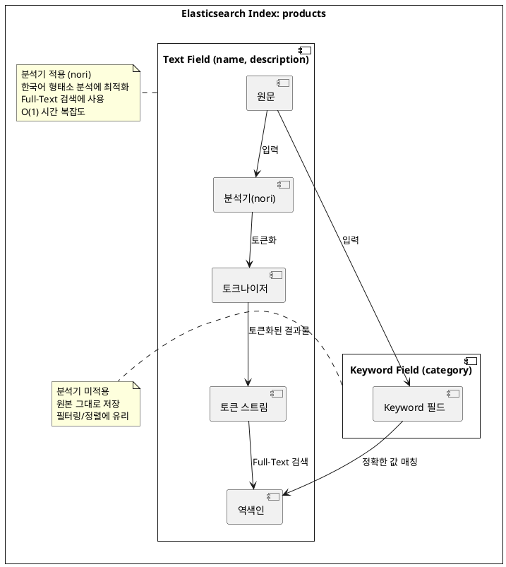

# 1. Elasticsearch 설치

```Dockerfile
FROM  elasticsearch:9.2.2
RUN bin/elasticsearch-plugin install --batch analysis-nori
```

```yml
services:
  elasticsearch:
    image: elasticsearch:nori
    build:
      context: .
      dockerfile: Dockerfile
    container_name: elasticsearch
    ports:
      - "9200:9200"
    environment:
      - discovery.type=single-node
      - xpack.security.enabled=false
```

# 2. application.yml 설정

```yml
spring:
  application:
    name: demo
  elasticsearch:
    uris:
      - http://localhost:9200
```

# 3. ElasticsearchConfig 설정

```kotlin
// src/main/kotlin/com/example/demo/globals/configs/ElasticsearchConfig.kt
@Configuration
@EnableElasticsearchRepositories(basePackages = ["com.example.demo"])
class ElasticsearchConfig
```

### @EnableElasticsearchRepositories란?

`@EnableElasticsearchRepositories`는 Spring Data Elasticsearch의 Repository 인터페이스를 자동으로 스캔하고 구현체를 생성해주는 어노테이션입니다.

**왜 필요한가?**

Spring Data JPA를 사용할 때 `@EnableJpaRepositories`가 자동 설정되는 것과 달리, **Elasticsearch는 명시적으로 활성화**해줘야 합니다. 이 어노테이션이 없으면
`ElasticsearchRepository`를 상속받은 인터페이스가 빈(Bean)으로 등록되지 않아 의존성 주입 시 오류가 발생합니다.

**주요 속성:**

| 속성                   | 설명                     | 예시                         |
|----------------------|------------------------|----------------------------|
| `basePackages`       | Repository를 스캔할 패키지 경로 | `["com.example.demo"]`     |
| `basePackageClasses` | 스캔 기준이 될 클래스           | `ProductRepository::class` |
| `excludeFilters`     | 스캔에서 제외할 필터            | -                          |

> **참고**: `basePackages`를 지정하지 않으면 해당 설정 클래스가 위치한 패키지와 그 하위 패키지를 스캔합니다.

# 4. Product Document 정의

Spring Data Elasticsearch에서는 `@Document` 어노테이션을 사용하여 Elasticsearch 인덱스와 매핑되는 도메인 클래스를 정의합니다.

```kotlin
// src/main/kotlin/com/example/demo/products/documents/Product.kt
@Document(indexName = "products")
data class Product(
    @Id
    val id: String? = null,

    @Field(type = FieldType.Text, analyzer = "nori")
    val name: String,

    @Field(type = FieldType.Text, analyzer = "nori")
    val description: String,

    @Field(type = FieldType.Keyword)
    val category: String,

    @Field(type = FieldType.Long)
    val price: Long,

    @Field(type = FieldType.Integer)
    val stock: Int,

    @Field(type = FieldType.Date, format = [DateFormat.date_hour_minute_second])
    val createdAt: LocalDateTime,

    @Field(type = FieldType.Boolean)
    val available: Boolean
)
```

> **참고**: `@Id` 어노테이션은 Elasticsearch 문서의 고유 식별자(`_id`)와 매핑됩니다. 값을 지정하지 않으면 Elasticsearch가 자동으로 생성합니다.

### 필드 타입 이해하기

Elasticsearch에서 주로 사용되는 필드 타입은 다음과 같습니다:

| 필드 타입              | 설명           | 용도                |
|--------------------|--------------|-------------------|
| **Text**           | 분석기를 통해 토큰화됨 | Full-Text 검색      |
| **Keyword**        | 분석기를 거치지 않음  | 정확한 값 매칭, 필터링, 정렬 |
| **Long / Integer** | 숫자 타입        | 범위 검색, 정렬         |
| **Date**           | 날짜/시간 타입     | 날짜 범위 검색          |
| **Boolean**        | 참/거짓         | 필터링               |

### Text vs Keyword

두 필드 타입의 가장 큰 차이점은 **분석기(Analyzer) 적용 여부**입니다.



### 토큰화(Tokenization)란?

토큰화는 문장을 단어나 형태소 단위로 분리하는 작업입니다.

**기본 분석기 예시:**
> `"Apple iPhone 13"` → `["apple", "iphone", "13"]`

**Nori 분석기 예시 (한국어):**
> `"삼성 갤럭시 스마트폰"` → `["삼성", "갤럭시", "스마트폰"]`

Nori 분석기는 한국어 **형태소(morpheme)** 단위로 분석합니다. 음절 단위가 아닌 의미 있는 최소 단위로 분리합니다.

> `"아버지가방에들어가신다"` → `["아버지", "가방", "들어가", "가시"]`

### Full-Text 검색 vs RDBMS LIKE 검색

토큰화된 필드는 **역색인(Inverted Index)**을 통해 검색되며, 이는 RDBMS의 `LIKE` 검색과 성능 면에서 큰 차이가 있습니다.

| 검색 방식                    | 시간 복잡도   | 동작 방식         |
|--------------------------|----------|---------------|
| RDBMS `LIKE '%keyword%'` | **O(n)** | 전체 레코드를 순차 탐색 |
| Elasticsearch Text 필드    | **O(1)** | 역색인 기반 즉시 조회  |

> **역색인(Inverted Index)**: 각 토큰이 어떤 문서에 포함되어 있는지를 미리 매핑해둔 자료구조입니다. 마치 책의 색인(Index)처럼 특정 단어가 어느 페이지에 있는지 바로 찾을 수 있습니다.

### Keyword 필드의 용도

Keyword 필드는 분석기를 거치지 않으므로 다음과 같은 상황에 적합합니다:

- 카테고리, 태그, 상태값 등 **정확히 일치하는 값** 검색
- 정렬(sorting) 및 집계(aggregation)
- 필터링(filtering)

### 필드 타입 선택의 중요성

RDBMS에서는 컬럼 타입(VARCHAR, INT 등)에 관계없이 쿼리 문법이 거의 동일합니다. 하지만 Elasticsearch에서는 **필드 타입에 따라 사용할 수 있는 쿼리와 성능이 크게 달라집니다.**

| 필드 타입   | 적합한 쿼리                  | 부적합한 쿼리                |
|---------|-------------------------|------------------------|
| Text    | `match`, `match_phrase` | `term`, 정렬             |
| Keyword | `term`, `terms`, 정렬     | `match` (동작은 하지만 비효율적) |

따라서 문서의 특성과 검색 요구사항을 고려하여 **적절한 필드 타입을 선택하는 것이 중요**합니다.

# 5. ProductRepository 정의

```kotlin
// src/main/kotlin/com/example/demo/products/repositories/ProductRepository.kt
interface ProductRepository : ElasticsearchRepository<Product, String> 
```

```kotlin
@Service
class ProductService(
    private val productRepository: ProductRepository
) 
```

# 6. Document 생성 예제

```kotlin
// src/test/kotlin/com/example/demo/ElasticsearchQueryTests.kt
@SpringBootTest
class ElasticsearchQueryDSLTests {
    @Autowired
    lateinit var productRepository: ProductRepository

    @Autowired
    lateinit var elasticsearchOperations: ElasticsearchOperations

    @BeforeEach
    fun setUp() {
        productRepository.deleteAll()
    }

    @Test
    fun `기본적인 문서 생성 작업`() {
        val product = Product(
            id = "1",
            name = "Sample Product",
            description = "This is a sample product",
            price = 2000,
            category = "Sample Category",
            stock = 50,
            createdAt = LocalDateTime.now(),
            available = true
        ).let(productRepository::save)
        assertNotNull(product.id)
    }

}
```

### ElasticsearchOperations란?

`ElasticsearchOperations`는 Spring Data Elasticsearch에서 제공하는 **인터페이스**로, Elasticsearch와의 모든 저수준(low-level) 작업을 추상화합니다.

**주요 기능:**

- 문서 CRUD 작업 (`save`, `get`, `delete`)
- 인덱스 관리 (`indexOps`)
- 복잡한 검색 쿼리 실행 (`search`)
- 벌크 작업 (`bulkIndex`, `bulkUpdate`)

### ElasticsearchOperations vs ElasticsearchTemplate

| 구분        | ElasticsearchOperations | ElasticsearchTemplate |
|-----------|-------------------------|-----------------------|
| **타입**    | 인터페이스                   | 구현체 (클래스)             |
| **역할**    | 계약(Contract) 정의         | 실제 동작 구현              |
| **권장 여부** | ✅ 권장                    | ⚠️ 직접 사용 비권장          |

`ElasticsearchTemplate`은 `ElasticsearchOperations` 인터페이스의 **구현체**입니다. Spring Boot가 자동으로 `ElasticsearchTemplate` 빈을 생성하고,
이를 `ElasticsearchOperations` 타입으로 주입받을 수 있습니다.

```kotlin
// 권장: 인터페이스 타입으로 주입
@Autowired
lateinit var elasticsearchOperations: ElasticsearchOperations

// 비권장: 구현체 타입으로 직접 주입
@Autowired
lateinit var elasticsearchTemplate: ElasticsearchTemplate
```

### 왜 ElasticsearchOperations를 사용하는가?

**Repository로 해결되지 않는 복잡한 쿼리**

`ElasticsearchRepository`는 간단한 CRUD와 메서드 이름 기반 쿼리를 지원하지만, 복잡한 집계(Aggregation)나 동적 쿼리는 `ElasticsearchOperations`를 직접 사용해야
합니다.

```kotlin
// Repository로는 어려운 복잡한 쿼리 예시
val query = NativeQuery.builder()
    .withQuery { q ->
        q.bool { b ->
            b.must { m -> m.match { it.field("name").query("스마트폰") } }
                .filter { f -> f.range { it.field("price").gte(JsonData.of(10000)) } }
        }
    }
    .withAggregation("category_agg", Aggregation.of { a ->
        a.terms { it.field("category") }
    })
    .build()

val result = elasticsearchOperations.search(query, Product::class.java)
```

# 7, TextField를 사용한 검색 예제

```kotlin
// src/main/kotlin/com/example/demo/products/repositories/ProductRepository.kt
fun findByName(name: String): List<Product>
fun findByNameIn(names: List<String>): List<Product>

```

```kotlin
// src/test/kotlin/com/example/demo/ElasticsearchQueryTests.kt
@Test
fun `Text 필드 검색 예제`() {
    println("ElasticsearchRepository 를 사용한 검색")
    println("1. Text 필드에 \"Apple\"이 포함된 문서 검색")
    val appleProducts = productRepository.findByName("Apple")
    assert(appleProducts.size == 2)
    appleProducts.forEach {
        println(it.name)
    }
    println("2. Text 필드에 여러 값이 포함된 문서 검색")
    val multiProducts = productRepository.findByNameIn(listOf("Apple", "Samsung"))
    assert(multiProducts.size == 3)
    multiProducts.forEach {
        println(it.name)
    }
    println("ElasticsearchOperations 를 사용한 검색")
    println("1. Text 필드에 \"Apple\"이 포함된 문서 검색")
    // Text 필드는 토큰화되므로 match 쿼리를 사용해야 합니다.
    // term 쿼리는 Keyword 필드에 사용합니다.
    val appleQuery = NativeQueryBuilder().withQuery { q ->
        q.match { m -> m.field("name").query("Apple") }
    }.build()
    val appleProductsWithNativeQuery = elasticsearchOperations.search(
        appleQuery,
        Product::class.java
    )
    assertContentEquals(appleProducts, appleProductsWithNativeQuery.map { it.content })
    appleProductsWithNativeQuery.forEach {
        println(it.content.name)
    }
    println("Text 필드에 여러 값이 포함된 문서 검색")
    println("1: Bool + Should (각 값마다 should 절 추가)")
    val multiQueryWithBool = NativeQueryBuilder().withQuery { q ->
        q.bool { b ->
            b.should { s -> s.match { m -> m.field("name").query("Apple") } }
            b.should { s -> s.match { m -> m.field("name").query("Samsung") } }
        }
    }.build()
    val multiQueryWithBoolQuery = elasticsearchOperations.search(
        multiQueryWithBool,
        Product::class.java
    )
    multiQueryWithBoolQuery.forEach {
        println(it.content.name)
    }
    println("2: simple_query_string - 여러 값을 OR로 연결하여 더 간결하게 작성")
    val multiQueryWithSimpleQueryString = NativeQueryBuilder().withQuery { q ->
        q.simpleQueryString { s ->
            s.query("Apple | Samsung")
                .fields("name")
        }
    }.build()
    val multiProductsWithSimpleQueryStringQuery = elasticsearchOperations.search(
        multiQueryWithSimpleQueryString,
        Product::class.java
    )
    multiProductsWithSimpleQueryStringQuery.forEach {
        println(it.content.name)
    }
    assertContentEquals(multiProducts, multiQueryWithBoolQuery.map { it.content })
    assertContentEquals(multiProducts, multiProductsWithSimpleQueryStringQuery.map { it.content })
    println("Keyword 필드로 검색 했을 때와의 차이점 확인")
    val keywordQuery = NativeQueryBuilder().withQuery { q ->
        q.term { t -> t.field("name").value("Apple") }
    }.build()
    val keywordProducts = elasticsearchOperations.search(
        keywordQuery,
        Product::class.java
    )
    keywordProducts.takeIf { it.none() }.let {
        println("Keyword 필드로는 'Apple' 단독 검색 시 문서가 검색되지 않음")
    }
    assert(keywordProducts.isEmpty)
}

```

> 실행결과

```
ElasticsearchRepository 를 사용한 검색
1. Text 필드에 "Apple"이 포함된 문서 검색
Apple iPhone 13
Apple MacBook Pro
2. Text 필드에 여러 값이 포함된 문서 검색
Samsung Galaxy S21
Apple iPhone 13
Apple MacBook Pro
ElasticsearchOperations 를 사용한 검색
1. Text 필드에 "Apple"이 포함된 문서 검색
Apple iPhone 13
Apple MacBook Pro
Text 필드에 여러 값이 포함된 문서 검색
1: Bool + Should (각 값마다 should 절 추가)
Samsung Galaxy S21
Apple iPhone 13
Apple MacBook Pro
2: simple_query_string - 여러 값을 OR로 연결하여 더 간결하게 작성
Samsung Galaxy S21
Apple iPhone 13
Apple MacBook Pro
Keyword 필드로 검색 했을 때와의 차이점 확인
Keyword 필드로는 'Apple' 단독 검색 시 문서가 검색되지 않음
```

### match, term, terms 쿼리의 차이

Elasticsearch에서 가장 많이 사용되는 세 가지 쿼리입니다. 각 쿼리는 **사용 목적과 대상 필드 타입이 다릅니다.**

#### 한눈에 보는 비교표

| 쿼리        | 대상 필드   | 분석기 적용 | 용도            | 예시                                            |
|-----------|---------|--------|---------------|-----------------------------------------------|
| **match** | Text    | ✅ 적용   | Full-Text 검색  | `"Apple iPhone"` → `["apple", "iphone"]`으로 검색 |
| **term**  | Keyword | ❌ 미적용  | 정확한 값 1개 매칭   | `"Electronics"` 정확히 일치하는 문서 검색                |
| **terms** | Keyword | ❌ 미적용  | 정확한 값 여러 개 매칭 | `["Electronics", "Computers"]` 중 하나라도 일치      |

#### 1. match 쿼리 (Text 필드용)

`match` 쿼리는 **검색어를 분석기로 토큰화한 후** 검색합니다.

```kotlin
// "Apple iPhone"을 검색하면 → ["apple", "iphone"]으로 토큰화
// name 필드에 "apple" 또는 "iphone"이 포함된 문서를 찾음
val query = NativeQueryBuilder().withQuery { q ->
    q.match { m -> m.field("name").query("Apple iPhone") }
}.build()
```

**특징:**

- 대소문자를 구분하지 않음 (`"Apple"` = `"apple"`)
- 검색어가 여러 단어면 OR 조건으로 검색 (기본값)
- **Text 필드에서만 사용** (Keyword 필드에서도 동작하지만 비효율적)

#### 2. term 쿼리 (Keyword 필드용)

`term` 쿼리는 **검색어를 분석하지 않고 정확히 일치하는 값**을 찾습니다.

```kotlin
// category가 정확히 "Electronics"인 문서만 검색
val query = NativeQueryBuilder().withQuery { q ->
    q.term { t -> t.field("category").value("Electronics") }
}.build()
```

**특징:**

- 대소문자를 구분함 (`"Electronics"` ≠ `"electronics"`)
- 정확히 일치해야만 검색됨
- **Keyword 필드에서 사용** (Text 필드에서는 제대로 동작하지 않음)

#### 3. terms 쿼리 (Keyword 필드용, 다중 값)

`terms` 쿼리는 **여러 값 중 하나라도 일치하면** 검색됩니다. SQL의 `IN` 연산자와 유사합니다.

```kotlin
// category가 "Electronics" 또는 "Computers"인 문서 검색
// SQL: WHERE category IN ('Electronics', 'Computers')
val query = NativeQueryBuilder().withQuery { q ->
    q.terms { t ->
        t.field("category")
            .terms { v ->
                v.value(
                    listOf(
                        FieldValue.of("Electronics"),
                        FieldValue.of("Computers")
                    )
                )
            }
    }
}.build()
```

**특징:**

- 여러 값을 한 번에 검색할 때 효율적
- **Keyword 필드에서만 사용**
- Text 필드에서는 `bool` + `should` + `match` 조합을 사용해야 함

#### ⚠️ 흔한 실수: Text 필드에 term 쿼리 사용

```kotlin
// ❌ 잘못된 예시: Text 필드에 term 쿼리 사용
val query = NativeQueryBuilder().withQuery { q ->
    q.term { t -> t.field("name").value("Apple") }  // name은 Text 필드!
}.build()
// 결과: 검색 안 됨!
```

**왜 안 될까?**

1. `"Apple iPhone 13"`이 Text 필드에 저장될 때 → `["apple", "iphone", "13"]`으로 토큰화
2. `term` 쿼리로 `"Apple"`을 검색 → 분석 없이 그대로 `"Apple"` 검색
3. 저장된 값은 소문자 `"apple"`, 검색어는 대문자 `"Apple"` → **불일치!**

```kotlin
// ✅ 올바른 예시: Text 필드에 match 쿼리 사용
val query = NativeQueryBuilder().withQuery { q ->
    q.match { m -> m.field("name").query("Apple") }  // match 사용!
}.build()
// 결과: "Apple"이 포함된 문서 검색됨
```

### simple_query_string 쿼리

`simple_query_string`은 **사용자 친화적인 검색 문법**을 제공하는 쿼리입니다. 검색창에서 사용자가 직접 입력할 수 있는 간단한 문법을 지원합니다.

#### 기본 사용법

```kotlin
val query = NativeQueryBuilder().withQuery { q ->
    q.simpleQueryString { s ->
        s.query("Apple | Samsung")  // Apple OR Samsung
            .fields("name")
    }
}.build()
```

#### 지원하는 연산자

| 연산자     | 의미    | 예시                   | 설명                   |
|---------|-------|----------------------|----------------------|
| `\|`    | OR    | `"Apple \| Samsung"` | Apple 또는 Samsung 포함  |
| `+`     | AND   | `"Apple + iPhone"`   | Apple과 iPhone 모두 포함  |
| `-`     | NOT   | `"Apple -iPhone"`    | Apple 포함, iPhone 제외  |
| `"..."` | 구문 검색 | `"\"iPhone 13\""`    | "iPhone 13"이 연속으로 포함 |
| `*`     | 와일드카드 | `"App*"`             | App으로 시작하는 단어        |
| `~N`    | 퍼지 검색 | `"Aple~1"`           | 오타 허용 (편집 거리 1)      |

#### 실전 예시

```kotlin
// 예시 1: OR 검색 - Apple 또는 Samsung이 포함된 제품
val orQuery = NativeQueryBuilder().withQuery { q ->
    q.simpleQueryString { s ->
        s.query("Apple | Samsung")
            .fields("name")
    }
}.build()

// 예시 2: AND 검색 - Apple과 iPhone이 모두 포함된 제품
val andQuery = NativeQueryBuilder().withQuery { q ->
    q.simpleQueryString { s ->
        s.query("Apple + iPhone")
            .fields("name")
    }
}.build()

// 예시 3: NOT 검색 - Apple은 포함하고 MacBook은 제외
val notQuery = NativeQueryBuilder().withQuery { q ->
    q.simpleQueryString { s ->
        s.query("Apple -MacBook")
            .fields("name")
    }
}.build()

// 예시 4: 여러 필드에서 검색
val multiFieldQuery = NativeQueryBuilder().withQuery { q ->
    q.simpleQueryString { s ->
        s.query("스마트폰")
            .fields("name", "description")  // name과 description 모두에서 검색
    }
}.build()
```

#### simple_query_string vs query_string

| 구분           | simple_query_string | query_string              |
|--------------|---------------------|---------------------------|
| **문법 오류 처리** | 무시하고 최대한 검색         | 오류 발생                     |
| **사용 대상**    | 일반 사용자 검색창          | 개발자/고급 사용자                |
| **지원 연산자**   | 기본 연산자만             | 더 많은 연산자 (AND, OR, NOT 등) |
| **안정성**      | ✅ 높음                | ⚠️ 잘못된 입력 시 에러            |

> **권장**: 사용자 입력을 직접 받는 검색창에는 `simple_query_string`을 사용하세요. 문법 오류가 발생해도 애플리케이션이 중단되지 않습니다.

### 쿼리 선택 가이드

```
검색하려는 필드가 Text 타입인가?
├── Yes → match 또는 simple_query_string 사용
│         ├── 단순 검색 → match
│         └── OR/AND/NOT 조합 → simple_query_string
└── No (Keyword 타입) → term 또는 terms 사용
                        ├── 값 1개 → term
                        └── 값 여러 개 → terms
```
