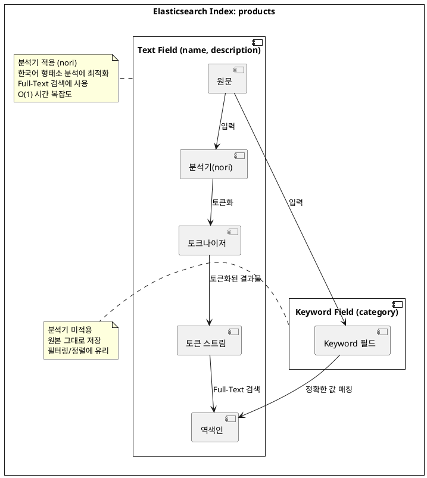

1. Elasticsearch 설치

```Dockerfile
FROM  elasticsearch:9.2.2
RUN bin/elasticsearch-plugin install --batch analysis-nori
```

```yml
services:
  elasticsearch:
    image: elasticsearch:nori
    build:
      context: .
      dockerfile: Dockerfile
    container_name: elasticsearch
    ports:
      - "9200:9200"
    environment:
      - discovery.type=single-node
      - xpack.security.enabled=false
```

2. application.yml 설정

```yml
spring:
  application:
    name: demo
  elasticsearch:
    uris:
      - http://localhost:9200
```

3. ElasticsearchConfig 설정

```kotlin
// src/main/kotlin/com/example/demo/globals/configs/ElasticsearchConfig.kt
@Configuration
@EnableElasticsearchRepositories(basePackages = ["com.example.demo"])
class ElasticsearchConfig
```

### @EnableElasticsearchRepositories란?

`@EnableElasticsearchRepositories`는 Spring Data Elasticsearch의 Repository 인터페이스를 자동으로 스캔하고 구현체를 생성해주는 어노테이션입니다.

**왜 필요한가?**

Spring Data JPA를 사용할 때 `@EnableJpaRepositories`가 자동 설정되는 것과 달리, **Elasticsearch는 명시적으로 활성화**해줘야 합니다. 이 어노테이션이 없으면
`ElasticsearchRepository`를 상속받은 인터페이스가 빈(Bean)으로 등록되지 않아 의존성 주입 시 오류가 발생합니다.

**주요 속성:**

| 속성                   | 설명                     | 예시                         |
|----------------------|------------------------|----------------------------|
| `basePackages`       | Repository를 스캔할 패키지 경로 | `["com.example.demo"]`     |
| `basePackageClasses` | 스캔 기준이 될 클래스           | `ProductRepository::class` |
| `excludeFilters`     | 스캔에서 제외할 필터            | -                          |

> **참고**: `basePackages`를 지정하지 않으면 해당 설정 클래스가 위치한 패키지와 그 하위 패키지를 스캔합니다.

4. Product Document 정의

Spring Data Elasticsearch에서는 `@Document` 어노테이션을 사용하여 Elasticsearch 인덱스와 매핑되는 도메인 클래스를 정의합니다.

```kotlin
// src/main/kotlin/com/example/demo/products/documents/Product.kt
@Document(indexName = "products")
data class Product(
    @Id
    val id: String? = null,

    @Field(type = FieldType.Text, analyzer = "nori")
    val name: String,

    @Field(type = FieldType.Text, analyzer = "nori")
    val description: String,

    @Field(type = FieldType.Keyword)
    val category: String,

    @Field(type = FieldType.Long)
    val price: Long,

    @Field(type = FieldType.Integer)
    val stock: Int,

    @Field(type = FieldType.Date, format = [DateFormat.date_hour_minute_second])
    val createdAt: LocalDateTime,

    @Field(type = FieldType.Boolean)
    val available: Boolean
)
```

> **참고**: `@Id` 어노테이션은 Elasticsearch 문서의 고유 식별자(`_id`)와 매핑됩니다. 값을 지정하지 않으면 Elasticsearch가 자동으로 생성합니다.

### 필드 타입 이해하기

Elasticsearch에서 주로 사용되는 필드 타입은 다음과 같습니다:

| 필드 타입              | 설명           | 용도                |
|--------------------|--------------|-------------------|
| **Text**           | 분석기를 통해 토큰화됨 | Full-Text 검색      |
| **Keyword**        | 분석기를 거치지 않음  | 정확한 값 매칭, 필터링, 정렬 |
| **Long / Integer** | 숫자 타입        | 범위 검색, 정렬         |
| **Date**           | 날짜/시간 타입     | 날짜 범위 검색          |
| **Boolean**        | 참/거짓         | 필터링               |

### Text vs Keyword

두 필드 타입의 가장 큰 차이점은 **분석기(Analyzer) 적용 여부**입니다.



### 토큰화(Tokenization)란?

토큰화는 문장을 단어나 형태소 단위로 분리하는 작업입니다.

**기본 분석기 예시:**
> `"Apple iPhone 13"` → `["apple", "iphone", "13"]`

**Nori 분석기 예시 (한국어):**
> `"삼성 갤럭시 스마트폰"` → `["삼성", "갤럭시", "스마트폰"]`

Nori 분석기는 한국어 **형태소(morpheme)** 단위로 분석합니다. 음절 단위가 아닌 의미 있는 최소 단위로 분리합니다.

> `"아버지가방에들어가신다"` → `["아버지", "가방", "들어가", "가시"]`

### Full-Text 검색 vs RDBMS LIKE 검색

토큰화된 필드는 **역색인(Inverted Index)**을 통해 검색되며, 이는 RDBMS의 `LIKE` 검색과 성능 면에서 큰 차이가 있습니다.

| 검색 방식                    | 시간 복잡도   | 동작 방식         |
|--------------------------|----------|---------------|
| RDBMS `LIKE '%keyword%'` | **O(n)** | 전체 레코드를 순차 탐색 |
| Elasticsearch Text 필드    | **O(1)** | 역색인 기반 즉시 조회  |

> **역색인(Inverted Index)**: 각 토큰이 어떤 문서에 포함되어 있는지를 미리 매핑해둔 자료구조입니다. 마치 책의 색인(Index)처럼 특정 단어가 어느 페이지에 있는지 바로 찾을 수 있습니다.

### Keyword 필드의 용도

Keyword 필드는 분석기를 거치지 않으므로 다음과 같은 상황에 적합합니다:

- 카테고리, 태그, 상태값 등 **정확히 일치하는 값** 검색
- 정렬(sorting) 및 집계(aggregation)
- 필터링(filtering)

### 필드 타입 선택의 중요성

RDBMS에서는 컬럼 타입(VARCHAR, INT 등)에 관계없이 쿼리 문법이 거의 동일합니다. 하지만 Elasticsearch에서는 **필드 타입에 따라 사용할 수 있는 쿼리와 성능이 크게 달라집니다.**

| 필드 타입   | 적합한 쿼리                  | 부적합한 쿼리                |
|---------|-------------------------|------------------------|
| Text    | `match`, `match_phrase` | `term`, 정렬             |
| Keyword | `term`, `terms`, 정렬     | `match` (동작은 하지만 비효율적) |

따라서 문서의 특성과 검색 요구사항을 고려하여 **적절한 필드 타입을 선택하는 것이 중요**합니다.

```
4. 