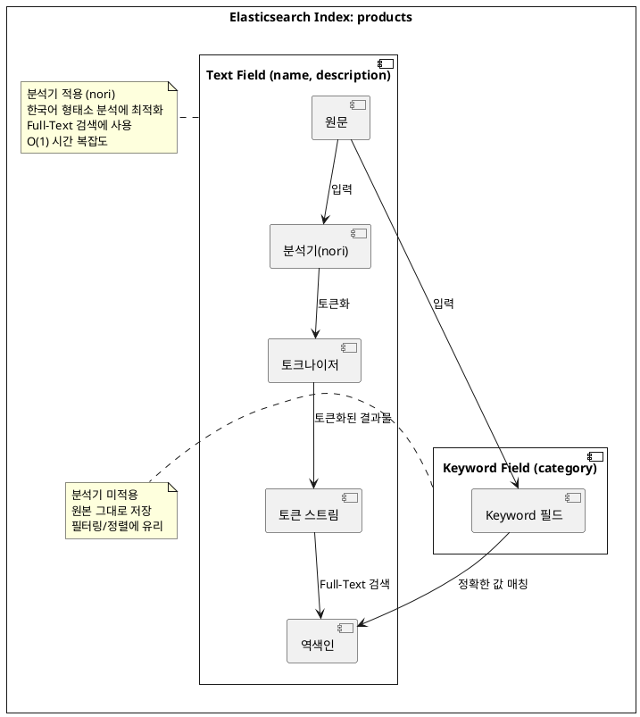

# 1. Elasticsearch 설치

```Dockerfile
FROM  elasticsearch:9.2.2
RUN bin/elasticsearch-plugin install --batch analysis-nori
```

```yml
services:
  elasticsearch:
    image: elasticsearch:nori
    build:
      context: .
      dockerfile: Dockerfile
    container_name: elasticsearch
    ports:
      - "9200:9200"
    environment:
      - discovery.type=single-node
      - xpack.security.enabled=false
```

# 2. application.yml 설정

```yml
spring:
  application:
    name: demo
  elasticsearch:
    uris:
      - http://localhost:9200
```

# 3. ElasticsearchConfig 설정

```kotlin
// src/main/kotlin/com/example/demo/globals/configs/ElasticsearchConfig.kt
@Configuration
@EnableElasticsearchRepositories(basePackages = ["com.example.demo"])
class ElasticsearchConfig
```

### @EnableElasticsearchRepositories란?

`@EnableElasticsearchRepositories`는 Spring Data Elasticsearch의 Repository 인터페이스를 자동으로 스캔하고 구현체를 생성해주는 어노테이션입니다.

**왜 필요한가?**

Spring Data JPA를 사용할 때 `@EnableJpaRepositories`가 자동 설정되는 것과 달리, **Elasticsearch는 명시적으로 활성화**해줘야 합니다. 이 어노테이션이 없으면
`ElasticsearchRepository`를 상속받은 인터페이스가 빈(Bean)으로 등록되지 않아 의존성 주입 시 오류가 발생합니다.

**주요 속성:**

| 속성                   | 설명                     | 예시                         |
|----------------------|------------------------|----------------------------|
| `basePackages`       | Repository를 스캔할 패키지 경로 | `["com.example.demo"]`     |
| `basePackageClasses` | 스캔 기준이 될 클래스           | `ProductRepository::class` |
| `excludeFilters`     | 스캔에서 제외할 필터            | -                          |

> **참고**: `basePackages`를 지정하지 않으면 해당 설정 클래스가 위치한 패키지와 그 하위 패키지를 스캔합니다.

# 4. Product Document 정의

Spring Data Elasticsearch에서는 `@Document` 어노테이션을 사용하여 Elasticsearch 인덱스와 매핑되는 도메인 클래스를 정의합니다.

```kotlin
// src/main/kotlin/com/example/demo/products/documents/Product.kt
@Document(indexName = "products")
data class Product(
    @Id
    val id: String? = null,

    @Field(type = FieldType.Text, analyzer = "nori")
    val name: String,

    @Field(type = FieldType.Text, analyzer = "nori")
    val description: String,

    @Field(type = FieldType.Keyword)
    val category: String,

    @Field(type = FieldType.Long)
    val price: Long,

    @Field(type = FieldType.Integer)
    val stock: Int,

    @Field(type = FieldType.Date, format = [DateFormat.date_hour_minute_second])
    val createdAt: LocalDateTime,

    @Field(type = FieldType.Boolean)
    val available: Boolean
)
```

> **참고**: `@Id` 어노테이션은 Elasticsearch 문서의 고유 식별자(`_id`)와 매핑됩니다. 값을 지정하지 않으면 Elasticsearch가 자동으로 생성합니다.

### 필드 타입 이해하기

Elasticsearch에서 주로 사용되는 필드 타입은 다음과 같습니다:

| 필드 타입              | 설명           | 용도                |
|--------------------|--------------|-------------------|
| **Text**           | 분석기를 통해 토큰화됨 | Full-Text 검색      |
| **Keyword**        | 분석기를 거치지 않음  | 정확한 값 매칭, 필터링, 정렬 |
| **Long / Integer** | 숫자 타입        | 범위 검색, 정렬         |
| **Date**           | 날짜/시간 타입     | 날짜 범위 검색          |
| **Boolean**        | 참/거짓         | 필터링               |

### Text vs Keyword

두 필드 타입의 가장 큰 차이점은 **분석기(Analyzer) 적용 여부**입니다.



### 토큰화(Tokenization)란?

토큰화는 문장을 단어나 형태소 단위로 분리하는 작업입니다.

**기본 분석기 예시:**
> `"Apple iPhone 13"` → `["apple", "iphone", "13"]`

**Nori 분석기 예시 (한국어):**
> `"삼성 갤럭시 스마트폰"` → `["삼성", "갤럭시", "스마트폰"]`

Nori 분석기는 한국어 **형태소(morpheme)** 단위로 분석합니다. 음절 단위가 아닌 의미 있는 최소 단위로 분리합니다.

> `"아버지가방에들어가신다"` → `["아버지", "가방", "들어가", "가시"]`

### Full-Text 검색 vs RDBMS LIKE 검색

토큰화된 필드는 **역색인(Inverted Index)**을 통해 검색되며, 이는 RDBMS의 `LIKE` 검색과 성능 면에서 큰 차이가 있습니다.

| 검색 방식                    | 시간 복잡도   | 동작 방식         |
|--------------------------|----------|---------------|
| RDBMS `LIKE '%keyword%'` | **O(n)** | 전체 레코드를 순차 탐색 |
| Elasticsearch Text 필드    | **O(1)** | 역색인 기반 즉시 조회  |

> **역색인(Inverted Index)**: 각 토큰이 어떤 문서에 포함되어 있는지를 미리 매핑해둔 자료구조입니다. 마치 책의 색인(Index)처럼 특정 단어가 어느 페이지에 있는지 바로 찾을 수 있습니다.

### Keyword 필드의 용도

Keyword 필드는 분석기를 거치지 않으므로 다음과 같은 상황에 적합합니다:

- 카테고리, 태그, 상태값 등 **정확히 일치하는 값** 검색
- 정렬(sorting) 및 집계(aggregation)
- 필터링(filtering)

### 필드 타입 선택의 중요성

RDBMS에서는 컬럼 타입(VARCHAR, INT 등)에 관계없이 쿼리 문법이 거의 동일합니다. 하지만 Elasticsearch에서는 **필드 타입에 따라 사용할 수 있는 쿼리와 성능이 크게 달라집니다.**

| 필드 타입   | 적합한 쿼리                  | 부적합한 쿼리                |
|---------|-------------------------|------------------------|
| Text    | `match`, `match_phrase` | `term`, 정렬             |
| Keyword | `term`, `terms`, 정렬     | `match` (동작은 하지만 비효율적) |

따라서 문서의 특성과 검색 요구사항을 고려하여 **적절한 필드 타입을 선택하는 것이 중요**합니다.

# 5. ProductRepository 정의

```kotlin
// src/main/kotlin/com/example/demo/products/repositories/ProductRepository.kt
interface ProductRepository : ElasticsearchRepository<Product, String> 
```

```kotlin
@Service
class ProductService(
    private val productRepository: ProductRepository
) 
```

# 6. Document 생성 예제

```kotlin
// src/test/kotlin/com/example/demo/ElasticsearchQueryTests.kt
@SpringBootTest
class ElasticsearchQueryDSLTests {
    @Autowired
    lateinit var productRepository: ProductRepository

    @Autowired
    lateinit var elasticsearchOperations: ElasticsearchOperations

    @BeforeEach
    fun setUp() {
        productRepository.deleteAll()
    }

    @Test
    fun `기본적인 문서 생성 작업`() {
        val product = Product(
            id = "1",
            name = "Sample Product",
            description = "This is a sample product",
            price = 2000,
            category = "Sample Category",
            stock = 50,
            createdAt = LocalDateTime.now(),
            available = true
        ).let(productRepository::save)
        assertNotNull(product.id)
    }

}
```

### ElasticsearchOperations란?

`ElasticsearchOperations`는 Spring Data Elasticsearch에서 제공하는 **인터페이스**로, Elasticsearch와의 모든 저수준(low-level) 작업을 추상화합니다.

**주요 기능:**

- 문서 CRUD 작업 (`save`, `get`, `delete`)
- 인덱스 관리 (`indexOps`)
- 복잡한 검색 쿼리 실행 (`search`)
- 벌크 작업 (`bulkIndex`, `bulkUpdate`)

### ElasticsearchOperations vs ElasticsearchTemplate

| 구분        | ElasticsearchOperations | ElasticsearchTemplate |
|-----------|-------------------------|-----------------------|
| **타입**    | 인터페이스                   | 구현체 (클래스)             |
| **역할**    | 계약(Contract) 정의         | 실제 동작 구현              |
| **권장 여부** | ✅ 권장                    | ⚠️ 직접 사용 비권장          |

`ElasticsearchTemplate`은 `ElasticsearchOperations` 인터페이스의 **구현체**입니다. Spring Boot가 자동으로 `ElasticsearchTemplate` 빈을 생성하고,
이를 `ElasticsearchOperations` 타입으로 주입받을 수 있습니다.

```kotlin
// 권장: 인터페이스 타입으로 주입
@Autowired
lateinit var elasticsearchOperations: ElasticsearchOperations

// 비권장: 구현체 타입으로 직접 주입
@Autowired
lateinit var elasticsearchTemplate: ElasticsearchTemplate
```

### 왜 ElasticsearchOperations를 사용하는가?

**Repository로 해결되지 않는 복잡한 쿼리**

`ElasticsearchRepository`는 간단한 CRUD와 메서드 이름 기반 쿼리를 지원하지만, 복잡한 집계(Aggregation)나 동적 쿼리는 `ElasticsearchOperations`를 직접 사용해야
합니다.

```kotlin
// Repository로는 어려운 복잡한 쿼리 예시
val query = NativeQuery.builder()
    .withQuery { q ->
        q.bool { b ->
            b.must { m -> m.match { it.field("name").query("스마트폰") } }
                .filter { f -> f.range { it.field("price").gte(JsonData.of(10000)) } }
        }
    }
    .withAggregation("category_agg", Aggregation.of { a ->
        a.terms { it.field("category") }
    })
    .build()

val result = elasticsearchOperations.search(query, Product::class.java)
```

# 7, TextField를 사용한 검색 예제

```kotlin
// src/main/kotlin/com/example/demo/products/repositories/ProductRepository.kt
fun findByName(name: String): List<Product>
fun findByNameIn(names: List<String>): List<Product>

```

```kotlin
// src/test/kotlin/com/example/demo/ElasticsearchQueryTests.kt
@Test
fun `Text 필드 검색 예제`() {
    println("ElasticsearchRepository 를 사용한 검색")
    println("1. Text 필드에 \"Apple\"이 포함된 문서 검색")
    val appleProducts = productRepository.findByName("Apple")
    assert(appleProducts.size == 2)
    appleProducts.forEach {
        println(it.name)
    }
    println("2. Text 필드에 여러 값이 포함된 문서 검색")
    val multiProducts = productRepository.findByNameIn(listOf("Apple", "Samsung"))
    assert(multiProducts.size == 3)
    multiProducts.forEach {
        println(it.name)
    }
    println("ElasticsearchOperations 를 사용한 검색")
    println("1. Text 필드에 \"Apple\"이 포함된 문서 검색")
    // Text 필드는 토큰화되므로 match 쿼리를 사용해야 합니다.
    // term 쿼리는 Keyword 필드에 사용합니다.
    val appleQuery = NativeQueryBuilder().withQuery { q ->
        q.match { m -> m.field("name").query("Apple") }
    }.build()
    val appleProductsWithNativeQuery = elasticsearchOperations.search(
        appleQuery,
        Product::class.java
    )
    assertContentEquals(appleProducts, appleProductsWithNativeQuery.map { it.content })
    appleProductsWithNativeQuery.forEach {
        println(it.content.name)
    }
    println("Text 필드에 여러 값이 포함된 문서 검색")
    println("1: Bool + Should (각 값마다 should 절 추가)")
    val multiQueryWithBool = NativeQueryBuilder().withQuery { q ->
        q.bool { b ->
            b.should { s -> s.match { m -> m.field("name").query("Apple") } }
            b.should { s -> s.match { m -> m.field("name").query("Samsung") } }
        }
    }.build()
    val multiQueryWithBoolQuery = elasticsearchOperations.search(
        multiQueryWithBool,
        Product::class.java
    )
    multiQueryWithBoolQuery.forEach {
        println(it.content.name)
    }
    println("2: simple_query_string - 여러 값을 OR로 연결하여 더 간결하게 작성")
    val multiQueryWithSimpleQueryString = NativeQueryBuilder().withQuery { q ->
        q.simpleQueryString { s ->
            s.query("Apple | Samsung")
                .fields("name")
        }
    }.build()
    val multiProductsWithSimpleQueryStringQuery = elasticsearchOperations.search(
        multiQueryWithSimpleQueryString,
        Product::class.java
    )
    multiProductsWithSimpleQueryStringQuery.forEach {
        println(it.content.name)
    }
    assertContentEquals(multiProducts, multiQueryWithBoolQuery.map { it.content })
    assertContentEquals(multiProducts, multiProductsWithSimpleQueryStringQuery.map { it.content })
    println("Keyword 필드로 검색 했을 때와의 차이점 확인")
    val keywordQuery = NativeQueryBuilder().withQuery { q ->
        q.term { t -> t.field("name").value("Apple") }
    }.build()
    val keywordProducts = elasticsearchOperations.search(
        keywordQuery,
        Product::class.java
    )
    keywordProducts.takeIf { it.none() }.let {
        println("Keyword 필드로는 'Apple' 단독 검색 시 문서가 검색되지 않음")
    }
    assert(keywordProducts.isEmpty)
}

```

> 실행결과

```
ElasticsearchRepository 를 사용한 검색
1. Text 필드에 "Apple"이 포함된 문서 검색
Apple iPhone 13
Apple MacBook Pro
2. Text 필드에 여러 값이 포함된 문서 검색
Samsung Galaxy S21
Apple iPhone 13
Apple MacBook Pro
ElasticsearchOperations 를 사용한 검색
1. Text 필드에 "Apple"이 포함된 문서 검색
Apple iPhone 13
Apple MacBook Pro
Text 필드에 여러 값이 포함된 문서 검색
1: Bool + Should (각 값마다 should 절 추가)
Samsung Galaxy S21
Apple iPhone 13
Apple MacBook Pro
2: simple_query_string - 여러 값을 OR로 연결하여 더 간결하게 작성
Samsung Galaxy S21
Apple iPhone 13
Apple MacBook Pro
Keyword 필드로 검색 했을 때와의 차이점 확인
Keyword 필드로는 'Apple' 단독 검색 시 문서가 검색되지 않음
```

### match, term, terms 쿼리의 차이

Elasticsearch에서 가장 많이 사용되는 세 가지 쿼리입니다. 각 쿼리는 **사용 목적과 대상 필드 타입이 다릅니다.**

#### 한눈에 보는 비교표

| 쿼리        | 대상 필드   | 분석기 적용 | 용도            | 예시                                            |
|-----------|---------|--------|---------------|-----------------------------------------------|
| **match** | Text    | ✅ 적용   | Full-Text 검색  | `"Apple iPhone"` → `["apple", "iphone"]`으로 검색 |
| **term**  | Keyword | ❌ 미적용  | 정확한 값 1개 매칭   | `"Electronics"` 정확히 일치하는 문서 검색                |
| **terms** | Keyword | ❌ 미적용  | 정확한 값 여러 개 매칭 | `["Electronics", "Computers"]` 중 하나라도 일치      |

#### 1. match 쿼리 (Text 필드용)

`match` 쿼리는 **검색어를 분석기로 토큰화한 후** 검색합니다.

```kotlin
// "Apple iPhone"을 검색하면 → ["apple", "iphone"]으로 토큰화
// name 필드에 "apple" 또는 "iphone"이 포함된 문서를 찾음
val query = NativeQueryBuilder().withQuery { q ->
    q.match { m -> m.field("name").query("Apple iPhone") }
}.build()
```

**특징:**

- 대소문자를 구분하지 않음 (`"Apple"` = `"apple"`)
- 검색어가 여러 단어면 OR 조건으로 검색 (기본값)
- **Text 필드에서만 사용** (Keyword 필드에서도 동작하지만 비효율적)

#### 2. term 쿼리 (Keyword 필드용)

`term` 쿼리는 **검색어를 분석하지 않고 정확히 일치하는 값**을 찾습니다.

```kotlin
// category가 정확히 "Electronics"인 문서만 검색
val query = NativeQueryBuilder().withQuery { q ->
    q.term { t -> t.field("category").value("Electronics") }
}.build()
```

**특징:**

- 대소문자를 구분함 (`"Electronics"` ≠ `"electronics"`)
- 정확히 일치해야만 검색됨
- **Keyword 필드에서 사용** (Text 필드에서는 제대로 동작하지 않음)

#### 3. terms 쿼리 (Keyword 필드용, 다중 값)

`terms` 쿼리는 **여러 값 중 하나라도 일치하면** 검색됩니다. SQL의 `IN` 연산자와 유사합니다.

```kotlin
// category가 "Electronics" 또는 "Computers"인 문서 검색
// SQL: WHERE category IN ('Electronics', 'Computers')
val query = NativeQueryBuilder().withQuery { q ->
    q.terms { t ->
        t.field("category")
            .terms { v ->
                v.value(
                    listOf(
                        FieldValue.of("Electronics"),
                        FieldValue.of("Computers")
                    )
                )
            }
    }
}.build()
```

**특징:**

- 여러 값을 한 번에 검색할 때 효율적
- **Keyword 필드에서만 사용**
- Text 필드에서는 `bool` + `should` + `match` 조합을 사용해야 함

#### ⚠️ 흔한 실수: Text 필드에 term 쿼리 사용

```kotlin
// ❌ 잘못된 예시: Text 필드에 term 쿼리 사용
val query = NativeQueryBuilder().withQuery { q ->
    q.term { t -> t.field("name").value("Apple") }  // name은 Text 필드!
}.build()
// 결과: 검색 안 됨!
```

**왜 안 될까?**

1. `"Apple iPhone 13"`이 Text 필드에 저장될 때 → `["apple", "iphone", "13"]`으로 토큰화
2. `term` 쿼리로 `"Apple"`을 검색 → 분석 없이 그대로 `"Apple"` 검색
3. 저장된 값은 소문자 `"apple"`, 검색어는 대문자 `"Apple"` → **불일치!**

```kotlin
// ✅ 올바른 예시: Text 필드에 match 쿼리 사용
val query = NativeQueryBuilder().withQuery { q ->
    q.match { m -> m.field("name").query("Apple") }  // match 사용!
}.build()
// 결과: "Apple"이 포함된 문서 검색됨
```

### simple_query_string 쿼리

`simple_query_string`은 **사용자 친화적인 검색 문법**을 제공하는 쿼리입니다. 검색창에서 사용자가 직접 입력할 수 있는 간단한 문법을 지원합니다.

#### 기본 사용법

```kotlin
val query = NativeQueryBuilder().withQuery { q ->
    q.simpleQueryString { s ->
        s.query("Apple | Samsung")  // Apple OR Samsung
            .fields("name")
    }
}.build()
```

#### 지원하는 연산자

| 연산자     | 의미    | 예시                   | 설명                   |
|---------|-------|----------------------|----------------------|
| `\|`    | OR    | `"Apple \| Samsung"` | Apple 또는 Samsung 포함  |
| `+`     | AND   | `"Apple + iPhone"`   | Apple과 iPhone 모두 포함  |
| `-`     | NOT   | `"Apple -iPhone"`    | Apple 포함, iPhone 제외  |
| `"..."` | 구문 검색 | `"\"iPhone 13\""`    | "iPhone 13"이 연속으로 포함 |
| `*`     | 와일드카드 | `"App*"`             | App으로 시작하는 단어        |
| `~N`    | 퍼지 검색 | `"Aple~1"`           | 오타 허용 (편집 거리 1)      |

#### 실전 예시

```kotlin
// 예시 1: OR 검색 - Apple 또는 Samsung이 포함된 제품
val orQuery = NativeQueryBuilder().withQuery { q ->
    q.simpleQueryString { s ->
        s.query("Apple | Samsung")
            .fields("name")
    }
}.build()

// 예시 2: AND 검색 - Apple과 iPhone이 모두 포함된 제품
val andQuery = NativeQueryBuilder().withQuery { q ->
    q.simpleQueryString { s ->
        s.query("Apple + iPhone")
            .fields("name")
    }
}.build()

// 예시 3: NOT 검색 - Apple은 포함하고 MacBook은 제외
val notQuery = NativeQueryBuilder().withQuery { q ->
    q.simpleQueryString { s ->
        s.query("Apple -MacBook")
            .fields("name")
    }
}.build()

// 예시 4: 여러 필드에서 검색
val multiFieldQuery = NativeQueryBuilder().withQuery { q ->
    q.simpleQueryString { s ->
        s.query("스마트폰")
            .fields("name", "description")  // name과 description 모두에서 검색
    }
}.build()
```

#### simple_query_string vs query_string

| 구분           | simple_query_string | query_string              |
|--------------|---------------------|---------------------------|
| **문법 오류 처리** | 무시하고 최대한 검색         | 오류 발생                     |
| **사용 대상**    | 일반 사용자 검색창          | 개발자/고급 사용자                |
| **지원 연산자**   | 기본 연산자만             | 더 많은 연산자 (AND, OR, NOT 등) |
| **안정성**      | ✅ 높음                | ⚠️ 잘못된 입력 시 에러            |

> **권장**: 사용자 입력을 직접 받는 검색창에는 `simple_query_string`을 사용하세요. 문법 오류가 발생해도 애플리케이션이 중단되지 않습니다.

### 쿼리 선택 가이드

```
검색하려는 필드가 Text 타입인가?
├── Yes → match 또는 simple_query_string 사용
│         ├── 단순 검색 → match
│         └── OR/AND/NOT 조합 → simple_query_string
└── No (Keyword 타입) → term 또는 terms 사용
                        ├── 값 1개 → term
                        └── 값 여러 개 → terms
```
# 8. NumberField를 사용한 검색 예제
```kotlin
// src/main/kotlin/com/example/demo/products/repositories/ProductRepository.kt
fun findByPrice(price: Long): List<Product>
fun findByPriceGreaterThanEqual(price: Long): List<Product>
fun findByPriceLessThanEqual(price: Long): List<Product>
fun findByPriceBetween(minPrice: Long, maxPrice: Long): List<Product>
fun findByPriceIn(prices: List<Long>): List<Product>

```
```kotlin
// src/main/kotlin/com/example/demo/products/repositories/ProductRepository.kt
@Test
	fun `Number 필드 검색 예제`(){
		println("ElasticsearchRepository 를 사용한 검색")

		println("1. 가격이 1000 이상인 문서 검색")
		val price1000Products = productRepository.findByPriceGreaterThanEqual(1000)
		price1000Products.forEach {
			println("${it.name} - ${it.price}")
		}
		assert(price1000Products.size == 1)

		println("2. 가격이 900 이하인 문서 검색")
		val price900Products = productRepository.findByPriceLessThanEqual(900)
		price900Products.forEach {
			println("${it.name} - ${it.price}")
		}
		assert(price900Products.size == 1)

		println("3. 가격이 900 이상 1000 이하인 문서 검색")
		val price900to1000Products = productRepository.findByPriceBetween(900,1000)
		price900to1000Products.forEach {
			println("${it.name} - ${it.price}")
		}
		assert(price900to1000Products.size == 1)

		println("4. 가격이 899인 문서 검색")
		val price899Products = productRepository.findByPrice(899)
		price899Products.forEach {
			println("${it.name} - ${it.price}")
		}
		assert(price899Products.size == 1)

		println("ElasticsearchOperations 를 사용한 검색")
		
		println("1. 가격이 1000 이상인 문서 검색")
	    val price1000ProductsQuery = elasticsearchOperations.search(
			NativeQueryBuilder().withQuery { q ->
				q.range { r ->
					r.number { n->
						n.field("price").gte(1000.0)
					}
				}
			}.build(),
		    Product::class.java
	    )
		price1000ProductsQuery.forEach {
		    println("${it.content.name} - ${it.content.price}")
	    }
	    assert(price1000ProductsQuery.count() == 1)
		assertEquals(
			price1000Products.map { it.id },
			price1000ProductsQuery.searchHits.map{it.content.id}
		)

		println("2. 가격이 900 이하인 문서 검색")
		val price900ProductsQuery = elasticsearchOperations.search(
			NativeQueryBuilder().withQuery { q ->
				q.range { r ->
					r.number { n ->
						n.field("price").lte(900.0)
					}
				}
			}.build(),
			Product::class.java
		)
		price900ProductsQuery.forEach {
			println("${it.content.name} - ${it.content.price}")
		}
		assertEquals(
			price900Products.map { it.id },
			price900ProductsQuery.searchHits.map{it.content.id}
		)

		println("3. 가격이 900 이상 1000 이하인 문서 검색")
		val price900to1000ProductsQuery = elasticsearchOperations.search(
			NativeQueryBuilder().withQuery { q ->
				q.range { r ->
					r.number { n ->
						n.field("price").gte(900.0).lte(1000.0)
					}
				}
			}.build(),
			Product::class.java
		)
		assert(price900to1000ProductsQuery.count() == 1)
		assertEquals(
			price900to1000Products.map { it.id },
			price900to1000ProductsQuery.searchHits.map{it.content.id}
		)

		println("4. 가격이 899인 문서 검색")
		val price899ProductsQuery = elasticsearchOperations.search(
			NativeQueryBuilder().withQuery { q ->
				q.term { t -> t.field("price").value(899) }
			}.build(),
			Product::class.java
		)
		assert(price899ProductsQuery.count() == 1)
		assertEquals(
			price899Products.map { it.id },
			price899ProductsQuery.searchHits.map{it.content.id}
		)
```

### Number 필드에서 사용하는 쿼리

숫자 필드(Long, Integer, Double 등)는 **Keyword처럼 분석기를 거치지 않습니다.** 따라서 `term` 쿼리로 정확한 값 매칭이 가능합니다.

#### 숫자 필드에서 사용 가능한 쿼리

| 쿼리        | 용도           | 예시                                          |
|-----------|--------------|---------------------------------------------|
| **term**  | 정확한 값 1개 매칭  | `price == 899`                              |
| **terms** | 정확한 값 여러 개 매칭 | `price IN (899, 999, 1099)`                 |
| **range** | 범위 검색        | `price >= 900 AND price <= 1000`            |

#### term 쿼리로 숫자 정확 매칭

```kotlin
// Long 필드에서 정확히 899인 문서 검색
val query = NativeQueryBuilder().withQuery { q ->
    q.term { t -> t.field("price").value(899) }
}.build()
```

#### terms 쿼리로 여러 값 매칭

```kotlin
// price가 899, 999, 1099 중 하나인 문서 검색
// SQL: WHERE price IN (899, 999, 1099)
val query = NativeQueryBuilder().withQuery { q ->
    q.terms { t ->
        t.field("price")
            .terms { v ->
                v.value(
                    listOf(
                        FieldValue.of(899),
                        FieldValue.of(999),
                        FieldValue.of(1099)
                    )
                )
            }
    }
}.build()
```

#### range 쿼리로 범위 검색

```kotlin
// 가격이 900 이상 1000 이하인 문서 검색
// gte(), lte()는 Double 타입만 받으므로 .0을 붙여야 합니다
val query = NativeQueryBuilder().withQuery { q ->
    q.range { r ->
        r.number { n ->
            n.field("price").gte(900.0).lte(1000.0)
        }
    }
}.build()
```


```kotlin
// ✅ Range 쿼리: Double 파라미터여도 안전 (비교 연산)
n.field("price").gte(900.0).lte(1000.0)

// ⚠️ Term 쿼리: Double 필드에서 정확 매칭 시 주의 (정확 일치)
q.term { t -> t.field("price").value(899.99) }  // 실패 가능!
```


### Number 필드 쿼리 선택 가이드

```
숫자 값을 검색하려는가?
├── 정확한 값 매칭이 필요한가?
│   ├── 값 1개 → term
│   └── 값 여러 개 → terms
└── 범위 검색이 필요한가?
    └── range (gte, lte, gt, lt)
    
```
# 9. DateField를 사용한 검색 예제
```kotlin
// src/main/kotlin/com/example/demo/products/repositories/ProductRepository.kt
fun findByCreatedAtBetween(start: LocalDateTime, end: LocalDateTime): List<Product>
fun findByCreatedAtBefore(end: LocalDateTime): List<Product>
fun findByCreatedAtAfter(start: LocalDateTime): List<Product>

```
```kotlin
// src/main/kotlin/com/example/demo/products/repositories/ElasticsearchQueryTests.kt
@Test
fun `Date 필드 검색 예제`(){
	println("ElasticsearchRepository 를 사용한 검색")

	println("1. 생성일자가 3일 이내인 문서 검색")
	val recentProducts = productRepository.findByCreatedAtAfter(LocalDateTime.now().minusDays(3))
	recentProducts.forEach {
		println("${it.name} - ${it.createdAt}")
	}
	assert(recentProducts.size == 2)

	println("2. 생성일자가 5일 이전인 문서 검색")
	val olderProducts = productRepository.findByCreatedAtBefore(LocalDateTime.now().minusDays(5))
	olderProducts.forEach {
		println("${it.name} - ${it.createdAt}")
	}
	assert(olderProducts.size == 1)

	println("3. 생성시간이 12시간 에서 36시간 사이인 문서 검색")
	val betweenProducts = productRepository.findByCreatedAtBetween(
		LocalDateTime.now().minusHours(36),
		LocalDateTime.now().minusHours(12)
	)
	betweenProducts.forEach {
		println("${it.name} - ${it.createdAt}")
	}
	assert(betweenProducts.size == 1)

	println("ElasticsearchOperations 를 사용한 검색")
	println("1. 생성일자가 3일 이내인 문서 검색(DateMath사용)")
	val recentProductsQuery = elasticsearchOperations.search(
		NativeQueryBuilder().withQuery { q ->
			q.range { r ->
				r.date{d->
					d.field("createdAt")
						.gte("now-3d"
						)
				}
			}
		}.build(),
		Product::class.java
	)
	recentProductsQuery.forEach {
		println("${it.content.name} - ${it.content.createdAt}")
	}
	assertEquals(
		recentProducts.map { it.id },
		recentProductsQuery.searchHits.map{it.content.id}
	)

	println("2. 생성일자가 5일 이전인 문서 검색(Formatter로 정확한 날짜 지정)")
	val formatter = DateTimeFormatter.ofPattern("yyyy-MM-dd'T'HH:mm:ss")
	val olderProductsQuery = elasticsearchOperations.search(
		NativeQueryBuilder().withQuery { q ->
			q.range { r ->
				r.date { d->
					d.field("createdAt")
						.lte(LocalDateTime.now().minusDays(5).format(formatter))

				}
			}
		}.build(),
		Product::class.java
	)
	olderProductsQuery.forEach {
		println("${it.content.name} - ${it.content.createdAt}")
	}
	assertEquals(
		olderProducts.map { it.id },
		olderProductsQuery.searchHits.map{it.content.id}
	)


	println("3. 생성시간이 12시간 에서 36시간 사이인 문서 검색")
	val betweenProductsQuery = elasticsearchOperations.search(
		NativeQueryBuilder().withQuery { q ->
			q.range { r ->
				r.date { d->
					d.field("createdAt")
						.gte("now-36h")
						.lte("now-12h")
				}
			}
		}.build(),
		Product::class.java
	)
	betweenProductsQuery.forEach {
		println("${it.content.name} - ${it.content.createdAt}")
	}
	assertEquals(
		betweenProducts.map { it.id },
		betweenProductsQuery.searchHits.map{it.content.id}
	)
}
```

### Date 필드에서 사용하는 쿼리

Date 필드는 **range 쿼리**를 주로 사용하며, Elasticsearch의 **Date Math** 표현식을 활용할 수 있습니다.

#### Date 필드 검색 방법

| 방법 | 설명 | 예시 |
|-----|-----|-----|
| **Date Math** | 상대적 시간 표현 | `"now-3d"`, `"now-12h"` |
| **Formatter** | 정확한 날짜/시간 지정 | `"2024-01-15T10:30:00"` |

### Date Math 표현식

Elasticsearch는 **현재 시간(now)**을 기준으로 상대적인 날짜를 표현할 수 있습니다.

#### 기본 문법

```
now[+-][숫자][단위]
```

#### 지원하는 시간 단위

| 단위 | 의미 | 예시 |
|-----|-----|-----|
| `y` | 년 (year) | `now-1y` (1년 전) |
| `M` | 월 (month) | `now-3M` (3개월 전) |
| `w` | 주 (week) | `now-2w` (2주 전) |
| `d` | 일 (day) | `now-7d` (7일 전) |
| `h` | 시간 (hour) | `now-12h` (12시간 전) |
| `m` | 분 (minute) | `now-30m` (30분 전) |
| `s` | 초 (second) | `now-60s` (60초 전) |

#### Date Math 예시

```kotlin
// 최근 3일 이내 문서
q.range { r ->
    r.date { d -> d.field("createdAt").gte("now-3d") }
}

// 최근 12시간 ~ 36시간 사이 문서
q.range { r ->
    r.date { d -> d.field("createdAt").gte("now-36h").lte("now-12h") }
}

// 이번 달 시작부터 현재까지
q.range { r ->
    r.date { d -> d.field("createdAt").gte("now/M") }  // now/M = 이번 달 1일 00:00:00
}
```

#### 반올림(Rounding) 표현

`/` 를 사용하면 해당 단위의 시작점으로 반올림합니다.

| 표현 | 의미 |
|-----|-----|
| `now/d` | 오늘 00:00:00 |
| `now/M` | 이번 달 1일 00:00:00 |
| `now/y` | 올해 1월 1일 00:00:00 |

```kotlin
// 오늘 자정부터 현재까지
q.range { r ->
    r.date { d -> d.field("createdAt").gte("now/d") }
}

// 어제 하루 동안 (00:00:00 ~ 23:59:59)
q.range { r ->
    r.date { d -> d.field("createdAt").gte("now-1d/d").lt("now/d") }
}
```

### 정확한 날짜 지정 (Formatter 사용)

Date Math 대신 정확한 날짜/시간을 지정할 수도 있습니다.

```kotlin
val formatter = DateTimeFormatter.ofPattern("yyyy-MM-dd'T'HH:mm:ss")

// 특정 날짜 이후 문서 검색
val query = NativeQueryBuilder().withQuery { q ->
    q.range { r ->
        r.date { d ->
            d.field("createdAt")
                .gte(LocalDateTime.of(2024, 1, 1, 0, 0, 0).format(formatter))
                .lte(LocalDateTime.now().format(formatter))
        }
    }
}.build()
```

#### ⚠️ 날짜 포맷 주의사항

Document에 정의된 `@Field`의 `format`과 쿼리에서 사용하는 포맷이 일치해야 합니다.

```kotlin
// Document 정의
@Field(type = FieldType.Date, format = [DateFormat.date_hour_minute_second])
val createdAt: LocalDateTime

// 쿼리 시 포맷 (date_hour_minute_second = yyyy-MM-dd'T'HH:mm:ss)
val formatter = DateTimeFormatter.ofPattern("yyyy-MM-dd'T'HH:mm:ss")
```

### Date Math vs Formatter 선택 가이드

| 상황 | 권장 방법 | 예시 |
|-----|---------|-----|
| 상대적 시간 (최근 N일) | Date Math | `"now-7d"` |
| 특정 날짜/시간 | Formatter | `"2024-01-15T10:30:00"` |
| 배치 작업 (고정된 기간) | Formatter | 정확한 시작/종료 시간 |
| 실시간 대시보드 | Date Math | `"now-1h"`, `"now/d"` |

### Date 필드 쿼리 선택 가이드

```
날짜/시간을 검색하려는가?
├── 범위 검색 → range 쿼리
│   ├── 상대적 시간 (최근 N일) → Date Math ("now-3d")
│   └── 정확한 날짜 → Formatter 사용
└── 정확한 날짜 매칭 → term 쿼리 (비권장, 초 단위까지 정확히 일치해야 함)
```

# 9. BooleanField를 사용한 검색 예제
```kotlin
fun findByAvailable(available: Boolean): List<Product>
```
```kotlin
// src/main/kotlin/com/example/demo/products/repositories/ElasticsearchQueryTests.kt
fun `Bool 필드 검색 예제`(){
	println("ElasticsearchRepository 를 사용한 검색")

	println("1.판매 가능한 문서 검색")
	val availableProducts = productRepository.findByAvailable(true)
	availableProducts.forEach {
		println("${it.name} - ${it.stock} - ${it.available}")
	}
	assert(availableProducts.size == 3)

	println("2. 판매 불가능한 문서 검색")
	val unavailableProducts = productRepository.findByAvailable(false)
	unavailableProducts.forEach {
		println("${it.name} - ${it.stock} - ${it.available}")
	}
	assert(unavailableProducts.isEmpty())

	println("ElasticsearchOperations 를 사용한 검색")

	println("1. 재고가 100개 이상이고 판매 가능한 문서 검색")
	val availableProductsQuery = elasticsearchOperations.search(
		NativeQueryBuilder().withQuery { q ->
			q.bool { b ->
				b.must { m -> m.term { t -> t.field("available").value(true) } }
			}
		}.build(),
		Product::class.java
	)
	availableProductsQuery.forEach {
		println("${it.content.name} - ${it.content.stock} - ${it.content.available}")
	}
	assertEquals(
		availableProducts.map { it.id },
		availableProductsQuery.searchHits.map{it.content.id}
	)

	println("2. 판매 불가능한 문서 검색")
	val unavailableProductsQuery = elasticsearchOperations.search(
		NativeQueryBuilder().withQuery { q ->
			q.bool { b ->
				b.mustNot { m -> m.term { t -> t.field("available").value(true) } }
			}
		}.build(),
		Product::class.java
	)
	unavailableProductsQuery.forEach {
		println("${it.content.name} - ${it.content.stock} - ${it.content.available}")
	}
	assertEquals(
		unavailableProducts.map { it.id },
		unavailableProductsQuery.searchHits.map{it.content.id}
	)
	println("3. 그외의 조합으로 판매가능한 문서 검색")

	println("3-1, filter 절에 match 쿼리 사용")
	val availableProductsQueryWithFilterMatch = elasticsearchOperations.search(
		NativeQueryBuilder().withQuery { q ->
			q.bool { b ->
				b.filter { f -> f.match { t -> t.field("available").query(true) } }
			}
		}.build(),
		Product::class.java
	)
	availableProductsQueryWithFilterMatch.forEach {
		println("${it.content.name} - ${it.content.stock} - ${it.content.available}")
	}
	assertEquals(
		availableProducts.map { it.id },
		availableProductsQueryWithFilterMatch.searchHits.map{it.content.id}
	)
	println("3-2 , filter 절에 term 쿼리 사용")
	val availableProductsQueryWithFilterTerm = elasticsearchOperations.search(
		NativeQueryBuilder().withQuery { q ->
			q.bool { b ->
				b.filter { f -> f.term { t -> t.field("available").value(true) } }
			}
		}.build(),
		Product::class.java
	)
	availableProductsQueryWithFilterTerm.forEach {
		println("${it.content.name} - ${it.content.stock} - ${it.content.available}")
	}
	assertEquals(
		availableProducts.map { it.id },
		availableProductsQueryWithFilterTerm.searchHits.map{it.content.id}
	)
	println("3-3 , must 절에 match 쿼리 사용")
	val availableProductsQueryWithMustMatch = elasticsearchOperations.search(
		NativeQueryBuilder().withQuery { q ->
			q.bool { b ->
				b.must { m -> m.match { t -> t.field("available").query(true) } }
			}
		}.build(),
		Product::class.java
	)
	availableProductsQueryWithMustMatch.forEach {
		println("${it.content.name} - ${it.content.stock} - ${it.content.available}")
	}
	assertEquals(
		availableProducts.map { it.id },
		availableProductsQueryWithMustMatch.searchHits.map{it.content.id}
	)

	println("4. 그외의 필드에 대해서도 Bool 쿼리 작성 가능")
	println("4-1, 900 이상인 상품을 검색하되, 카테고리가 Computers인 상품을 우선 정렬")
	val complexBoolQuery = elasticsearchOperations.search(
		NativeQueryBuilder().withQuery { q ->
			q.bool { b ->
				b.must { m -> m.range { r -> r.number { n->n.field("price").gte(950.0) }} }
				b.should { m -> m.match { mt->mt.field("category").query("Computers") } }
			}
		}.build(),
		Product::class.java
	)
	complexBoolQuery.forEach {
		println("${it.content.name} - ${it.content.stock} - ${it.content.price}")
	}
	assertEquals(complexBoolQuery.searchHits.count(),2)
	assertEquals(complexBoolQuery.searchHits.first().content.category,"Computers")
	assertEquals(complexBoolQuery.searchHits.last().content.category,"Electronics")
}
```

### Boolean 필드에서 사용하는 쿼리

Boolean 필드는 `true` 또는 `false` 값만 가지며, **term 쿼리**로 검색합니다.

```kotlin
// 판매 가능한 상품 검색 (available = true)
val query = NativeQueryBuilder().withQuery { q ->
    q.term { t -> t.field("available").value(true) }
}.build()
```

### Bool 쿼리 이해하기

`bool` 쿼리는 여러 조건을 조합할 때 사용하는 **복합 쿼리**입니다.

#### Bool 쿼리 구성 요소

| 절 | 의미 | 필수 여부 | 스코어 영향 | SQL 비유 |
|---|-----|---------|---------|---------|
| **must** | 반드시 일치 | ✅ 필수 | ✅ 있음 | `AND` |
| **filter** | 반드시 일치 | ✅ 필수 | ❌ 없음 (캐싱됨) | `AND` |
| **should** | 하나 이상 일치 | ❌ 선택 | ✅ 있음 | `OR` 또는 스코어 부스팅 |
| **mustNot** | 일치하면 제외 | - | ❌ 없음 | `NOT` |

#### must: 필수 조건 (AND)

모든 `must` 조건을 만족해야 결과에 포함됩니다.

```kotlin
// name에 "Apple" 포함 AND price <= 1000
q.bool { b ->
    b.must { m -> m.match { it.field("name").query("Apple") } }
    b.must { m -> m.range { r -> r.number { n -> n.field("price").lte(1000.0) } } }
}
```

#### filter: 필수 조건 (AND, 스코어 무시)

`must`와 동일하게 필수 조건이지만, **스코어 계산을 하지 않고 캐싱**됩니다.

```kotlin
// 판매 가능하고 가격이 1000 이하인 상품 (필터링만)
q.bool { b ->
    b.filter { f -> f.term { t -> t.field("available").value(true) } }
    b.filter { f -> f.range { r -> r.number { n -> n.field("price").lte(1000.0) } } }
}
```

#### should: 선택 조건 (OR 또는 스코어 부스팅)

`should`는 상황에 따라 다르게 동작합니다.

**1. must/filter 없이 should만 있을 때 → OR 조건**

```kotlin
// "Apple" 또는 "Samsung" 포함된 문서 검색
q.bool { b ->
    b.should { s -> s.match { it.field("name").query("Apple") } }
    b.should { s -> s.match { it.field("name").query("Samsung") } }
}
// 결과: 둘 중 하나라도 포함되면 반환
```

**2. must/filter와 함께 있을 때 → 스코어 부스팅**

```kotlin
// 반드시 available=true (필수), "Apple" 포함되면 스코어 높임 (선택)
q.bool { b ->
    b.must { m -> m.term { t -> t.field("available").value(true) } }
    b.should { s -> s.match { it.field("name").query("Apple") } }
}
// 결과: 모든 available=true 문서 반환, Apple 포함 문서가 상위에 정렬
```

#### mustNot: 제외 조건 (NOT)

해당 조건에 일치하는 문서를 **결과에서 제외**합니다.

```kotlin
// 판매 불가능한 상품 검색 (available = true인 문서 제외)
q.bool { b ->
    b.mustNot { m -> m.term { t -> t.field("available").value(true) } }
}
```

> **참고**: `term(false)`와 `mustNot(term(true))`는 비슷하지만, `mustNot`은 필드가 없는 문서도 포함할 수 있습니다.

### Bool 쿼리 예시로 비교

```
데이터:
- Apple iPhone 13 (price: 999)
- Samsung Galaxy S21 (price: 899)  
- Apple MacBook Pro (price: 1999)

쿼리1: must(Apple) AND must(price <= 1000)
→ 결과: Apple iPhone 13 (1건)

쿼리2: should(Apple) OR should(Samsung)
→ 결과: Apple iPhone, Samsung Galaxy, Apple MacBook (3건)

쿼리3: must(price <= 1000) + should(Apple)
→ 결과: Apple iPhone (score 높음), Samsung Galaxy (score 낮음) (2건)
        Apple이 포함된 문서가 상위에 정렬됨
```

### 관련성 점수(Relevance Score)

Elasticsearch는 검색 결과를 반환할 때 각 문서에 **_score** 값을 부여합니다.

```kotlin
val results = elasticsearchOperations.search(query, Product::class.java)
results.forEach {
    println("${it.content.name} - score: ${it.score}")
}
```

#### 스코어 계산 방식

| 요소 | 설명 | 예시 |
|-----|-----|-----|
| **TF (Term Frequency)** | 검색어가 문서에 많이 등장할수록 점수 ↑ | "iPhone"이 3번 등장 > 1번 등장 |
| **IDF (Inverse Document Frequency)** | 검색어가 전체 문서에서 희귀할수록 점수 ↑ | "iPhone"보다 "iPhone15ProMax"가 더 희귀 |
| **Field Length** | 필드가 짧을수록 점수 ↑ | 제목에서 매칭 > 본문에서 매칭 |

```
"iPhone" 검색 예시:
문서1: "iPhone 15 Pro"           → score: 2.5 (짧은 제목)
문서2: "iPhone 케이스 모음"        → score: 1.8 
문서3: "스마트폰 악세서리 iPhone용" → score: 1.2 (긴 제목)
```

### must vs filter: 언제 무엇을 쓸까?

| 절 | 스코어 계산 | 캐싱 | 사용 시점 |
|---|----------|-----|---------|
| **must** | ✅ 계산함 | ❌ 안됨 | 검색어와의 관련성이 중요할 때 |
| **filter** | ❌ 안함 | ✅ 됨 | Yes/No 필터링만 필요할 때 |

#### 쿼리 타입별 스코어 비교

| 조합 | 스코어 계산 | 스코어 특징 |
|-----|----------|----------|
| `must` + `match` | ✅ 함 | TF-IDF 기반, 관련성에 따라 다양한 점수 |
| `must` + `term` | ✅ 함 | 일치하면 고정 점수 (보통 1.0 내외) |
| `filter` + `term` | ❌ 안함 | 항상 0, 필터링만 수행 |

> **결론**: `term` 쿼리처럼 Yes/No 판단만 필요한 경우, `must` 대신 `filter`를 사용하면 불필요한 스코어 계산을 생략하고 캐싱 효과도 얻을 수 있습니다.

### Filter 캐싱 방식

`filter`는 **Elasticsearch 서버 내부**에서 **Bitset 캐싱**을 사용합니다.

> Java Client는 쿼리를 전송만 하고, 캐싱은 **Elasticsearch 노드의 메모리**에서 이루어집니다.

**동작 원리:**
1. `filter` 조건을 처음 실행하면 Elasticsearch가 조건에 일치하는 문서 ID를 **Bitset**(비트 배열)으로 **노드 메모리에 저장**
2. 동일한 `filter` 조건이 다시 실행되면 캐시된 Bitset을 재사용
3. 인덱스에 새 문서가 추가되면 해당 부분만 업데이트

```
예: filter { term { field("available").value(true) } }

첫 번째 요청 (Java Client → Elasticsearch):
┌─────────────────────────────────────────────────────────┐
│ Elasticsearch 노드 메모리                                │
│ ┌─────────────────────────────────────────┐             │
│ │ 문서ID:  1   2   3   4   5   6   7   8  │             │
│ │ Bitset: [1] [1] [0] [1] [0] [1] [1] [0] │ ← 캐시 저장  │
│ └─────────────────────────────────────────┘             │
└─────────────────────────────────────────────────────────┘

두 번째 요청:
→ Elasticsearch가 캐시 히트! 다시 계산하지 않고 바로 응답
```

**캐싱되는 조건:**
- `term`, `terms`, `range`, `exists` 등 자주 사용되는 필터
- 세그먼트 단위로 캐싱 (세그먼트가 변경되지 않으면 캐시 유지)

**캐싱되지 않는 경우:**
- 작은 세그먼트 (문서 10,000개 미만 또는 전체의 3% 미만)
- `script` 쿼리 등 동적 쿼리

### Bool 쿼리 실전 예시

```kotlin
// 복합 조건: 
// - 이름에 "iPhone" 포함 (must) → 스코어에 반영
// - 판매 가능 (filter) → 필터링만
// - 가격 1000 이하 (filter) → 필터링만
// - 품절 상품 제외 (mustNot)
// - "Pro" 포함시 상위 정렬 (should) → 스코어 부스팅
val query = NativeQueryBuilder().withQuery { q ->
    q.bool { b ->
        b.must { m -> m.match { it.field("name").query("iPhone") } }
        b.filter { f -> f.term { t -> t.field("available").value(true) } }
        b.filter { f -> f.range { r -> r.number { n -> n.field("price").lte(1000.0) } } }
        b.mustNot { m -> m.term { t -> t.field("stock").value(0) } }
        b.should { s -> s.match { it.field("name").query("Pro") } }
    }
}.build()
```

자연어로 표현하면:
> **"이름에 iPhone이 포함되고, 판매 가능하며, 가격이 1000 이하이고, 품절이 아닌 상품을 검색하되, Pro가 포함된 상품을 우선 정렬"**

### Bool 쿼리 선택 가이드

```
조건을 어떻게 조합할까?
│
├── 필수 조건인가?
│   ├── Yes + 스코어 필요 → must
│   └── Yes + 필터링만 → filter (성능 좋음)
│
├── 선택 조건인가? (있으면 좋고, 없어도 됨)
│   └── should (스코어 부스팅)
│
└── 제외 조건인가?
    └── mustNot
```

# 10. Sort를 사용한 정렬 예제

```kotlin
// src/main/kotlin/com/example/demo/products/repositories/ProductRepository.kt
// 메서드 네이밍으로 정렬
fun findAllByOrderByPriceAsc(): List<Product>
fun findAllByOrderByPriceDesc(): List<Product>

// Sort 파라미터로 동적 정렬
fun findByAvailable(available: Boolean, sort: Sort): List<Product>
```

```kotlin
// src/test/kotlin/com/example/demo/ElasticsearchQueryTests.kt

@Test
fun `Sort를 사용한 정렬 예제`() {
	println("=== ElasticsearchRepository를 사용한 정렬 ===")

	println("1. 가격 오름차순 정렬")
	val priceAscProducts = productRepository.findAllByOrderByPriceAsc()
	priceAscProducts.forEach {
		println("${it.name} - ${it.price}")
	}
	assertEquals(3, priceAscProducts.size)
	assertEquals(899, priceAscProducts.first().price)
	assertEquals(1999, priceAscProducts.last().price)

	println("2. 가격 내림차순 정렬")
	val priceDescProducts = productRepository.findAllByOrderByPriceDesc()
	priceDescProducts.forEach {
		println("${it.name} - ${it.price}")
	}
	assertEquals(3, priceDescProducts.size)
	assertEquals(1999, priceDescProducts.first().price)
	assertEquals(899, priceDescProducts.last().price)

	println("3. 복합 정렬 (카테고리 오름차순 + 가격 내림차순)")
	val multiSort = productRepository.findByAvailable(
		true,
		Sort.by(Sort.Direction.ASC, "category").and(Sort.by(Sort.Direction.DESC, "price"))
	)
	multiSort.forEach {
		println("${it.name} - ${it.category} - ${it.price}")
	}
	assertEquals(3, multiSort.size)
	assertEquals("Computers", multiSort.first().category)

	println("\n=== ElasticsearchOperations를 사용한 정렬 ===")

	println("1. 가격 오름차순 정렬")
	val priceAscQuery = elasticsearchOperations.search(
		NativeQueryBuilder()
			.withQuery { q -> q.matchAll { it } }
			.withSort(Sort.by(Sort.Direction.ASC, "price"))
			.build(),
		Product::class.java
	)
	priceAscQuery.forEach {
		println("${it.content.name} - ${it.content.price}")
	}
	assertEquals(3, priceAscQuery.searchHits.size)
	assertEquals(
		priceAscProducts.map { it.id },
		priceAscQuery.searchHits.map { it.content.id }
	)

	println("2. 가격 내림차순 정렬")
	val priceDescQuery = elasticsearchOperations.search(
		NativeQueryBuilder()
			.withQuery { q -> q.matchAll { it } }
			.withSort(Sort.by(Sort.Direction.DESC, "price"))
			.build(),
		Product::class.java
	)
	priceDescQuery.forEach {
		println("${it.content.name} - ${it.content.price}")
	}
	assertEquals(3, priceDescQuery.searchHits.size)
	assertEquals(
		priceDescProducts.map { it.id },
		priceDescQuery.searchHits.map { it.content.id }
	)

	println("3. 복합 정렬 (카테고리 오름차순 + 가격 내림차순)")
	val multiSortQuery = elasticsearchOperations.search(
		NativeQueryBuilder()
			.withQuery { q -> q.term { t -> t.field("available").value(true) } }
			.withSort(Sort.by(Sort.Direction.ASC, "category").and(Sort.by(Sort.Direction.DESC, "price")))
			.build(),
		Product::class.java
	)
	multiSortQuery.forEach {
		println("${it.content.name} - ${it.content.category} - ${it.content.price}")
	}
	assertEquals(3, multiSortQuery.searchHits.size)
	assertEquals(
		multiSort.map { it.id },
		multiSortQuery.searchHits.map { it.content.id }
	)
}
```

### 복합 정렬

여러 필드를 기준으로 정렬할 때는 `and()` 메서드를 사용합니다.

```kotlin
// 카테고리 오름차순 → 같은 카테고리 내에서 가격 내림차순
val multiSort = Sort.by(Sort.Direction.ASC, "category")
    .and(Sort.by(Sort.Direction.DESC, "price"))

// Repository 사용
productRepository.findByAvailable(true, multiSort)

// ElasticsearchOperations 사용
NativeQueryBuilder()
    .withQuery { q -> q.matchAll { it } }
    .withSort(multiSort)
    .build()
```

### 정렬 가능한 필드 타입

| 필드 타입 | 정렬 가능 | 비고 |
|---------|---------|-----|
| **Keyword** | ✅ | 알파벳/유니코드 순 |
| **Long/Integer** | ✅ | 숫자 크기순 |
| **Double/Float** | ✅ | 숫자 크기순 |
| **Date** | ✅ | 시간순 |
| **Boolean** | ✅ | false(0) < true(1) |
| **Text** | ⚠️ | 직접 정렬 불가, `.keyword` 서브필드 필요 |

#### Text 필드 정렬 주의사항

Text 필드는 분석기를 거쳐 토큰화되므로 **직접 정렬이 불가능**합니다.

```kotlin
// ❌ 잘못된 예시: Text 필드로 직접 정렬
Sort.by("name")  // name이 Text 필드면 에러 발생

// ✅ 올바른 예시: Keyword 서브필드 사용 (멀티필드 설정 필요)
Sort.by("name.keyword")
```

### 정렬 선택 가이드

```
정렬 기준이 고정되어 있는가?
├── Yes → Repository 메서드 네이밍 (findAllByOrderByPriceAsc)
└── No (동적 정렬 필요)
    ├── 단순 조회 → Repository + Sort 파라미터
    └── 복잡한 쿼리와 함께 → ElasticsearchOperations + withSort()
```

# 11. Pagination을 사용한 페이징 예제

```kotlin
// src/main/kotlin/com/example/demo/products/repositories/ProductRepository.kt
// 페이징 관련 메서드
fun findAllBy(pageable: Pageable): Page<Product>
fun findByAvailable(available: Boolean, pageable: Pageable): Page<Product>
```

```kotlin
// src/test/kotlin/com/example/demo/ElasticsearchQueryTests.kt
@Test
fun `Pagination을 사용한 페이징 예제`() {
    println("=== ElasticsearchRepository를 사용한 페이징 ===")

    println("1. 기본 페이징 (첫 번째 페이지, 2개씩)")
    val page0 = productRepository.findAllBy(PageRequest.of(0, 2))
    assertEquals(2, page0.content.size)
    assertEquals(5, page0.totalElements)
    assertEquals(3, page0.totalPages)
    assertEquals(0, page0.number)
    assertEquals(true, page0.hasNext())

    println("2. 두 번째 페이지")
    val page1 = productRepository.findAllBy(PageRequest.of(1, 2))
    assertEquals(2, page1.content.size)
    assertEquals(1, page1.number)

    println("3. 마지막 페이지")
    val page2 = productRepository.findAllBy(PageRequest.of(2, 2))
    assertEquals(1, page2.content.size)
    assertEquals(false, page2.hasNext())

    println("4. 페이징 + 정렬 (가격 오름차순)")
    val pageWithSort = productRepository.findAllBy(
        PageRequest.of(0, 2, Sort.by(Sort.Direction.ASC, "price"))
    )
    assertEquals(299, pageWithSort.content.first().price)

    println("5. 조건 + 페이징 (available=true)")
    val pageWithCondition = productRepository.findByAvailable(true, PageRequest.of(0, 2))
    assertEquals(2, pageWithCondition.content.size)

    println("\n=== ElasticsearchOperations를 사용한 페이징 ===")

    println("1. 기본 페이징 (첫 번째 페이지, 2개씩)")
    val page0Query = elasticsearchOperations.search(
        NativeQueryBuilder()
            .withQuery { q -> q.matchAll { it } }
            .withPageable(PageRequest.of(0, 2))
            .build(),
        Product::class.java
    )
    assertEquals(2, page0Query.searchHits.size)
    assertEquals(5, page0Query.totalHits)

    println("4. 페이징 + 정렬 (가격 오름차순)")
    val pageWithSortQuery = elasticsearchOperations.search(
        NativeQueryBuilder()
            .withQuery { q -> q.matchAll { it } }
            .withPageable(PageRequest.of(0, 2, Sort.by(Sort.Direction.ASC, "price")))
            .build(),
        Product::class.java
    )

    println("5. 조건 + 페이징 (available=true)")
    val pageWithConditionQuery = elasticsearchOperations.search(
        NativeQueryBuilder()
            .withQuery { q -> q.term { t -> t.field("available").value(true) } }
            .withPageable(PageRequest.of(0, 2))
            .build(),
        Product::class.java
    )
    assertEquals(5, pageWithConditionQuery.totalHits)
}
```

### 페이징 방법 비교

#### 1. ElasticsearchRepository - Pageable 파라미터 방식

`Pageable` 객체를 파라미터로 받아 페이징을 수행합니다. 반환 타입은 `Page<T>`입니다.

```kotlin
// Repository 정의
fun findAllBy(pageable: Pageable): Page<Product>
fun findByAvailable(available: Boolean, pageable: Pageable): Page<Product>

// 사용 예시
val page = productRepository.findAllBy(PageRequest.of(0, 10))
```

#### 2. ElasticsearchOperations - withPageable 방식

`NativeQueryBuilder`의 `withPageable()` 메서드를 사용합니다.

```kotlin
val query = NativeQueryBuilder()
    .withQuery { q -> q.matchAll { it } }
    .withPageable(PageRequest.of(0, 10))
    .build()

val results = elasticsearchOperations.search(query, Product::class.java)
```

### PageRequest 생성 방법

```kotlin
// 기본 페이징 (페이지 번호, 페이지 크기)
PageRequest.of(0, 10)  // 첫 번째 페이지, 10개씩

// 페이징 + 정렬
PageRequest.of(0, 10, Sort.by(Sort.Direction.ASC, "price"))

// 페이징 + 복합 정렬
PageRequest.of(0, 10, Sort.by(Sort.Direction.ASC, "category")
    .and(Sort.by(Sort.Direction.DESC, "price")))
```

### Page 객체의 주요 속성

| 속성/메서드 | 설명 | 예시 값 |
|-----------|-----|--------|
| `content` | 현재 페이지의 데이터 목록 | `List<Product>` |
| `totalElements` | 전체 문서 수 | `100` |
| `totalPages` | 전체 페이지 수 | `10` |
| `number` | 현재 페이지 번호 (0부터 시작) | `0` |
| `size` | 페이지 크기 | `10` |
| `hasNext()` | 다음 페이지 존재 여부 | `true` |
| `hasPrevious()` | 이전 페이지 존재 여부 | `false` |
| `isFirst()` | 첫 번째 페이지 여부 | `true` |
| `isLast()` | 마지막 페이지 여부 | `false` |

### ElasticsearchOperations 페이징 결과

`ElasticsearchOperations`의 `search()` 메서드는 `SearchHits<T>`를 반환합니다.

```kotlin
val results = elasticsearchOperations.search(query, Product::class.java)

// 주요 속성
results.totalHits        // 전체 문서 수 (Long)
results.searchHits       // 현재 페이지의 SearchHit 목록
results.searchHits.size  // 현재 페이지의 문서 수
```

> **참고**: `SearchHits`는 `Page`와 달리 `totalPages`, `hasNext()` 등의 메서드가 없습니다. 필요하다면 직접 계산해야 합니다.

```kotlin
// 전체 페이지 수 계산
val totalPages = (results.totalHits + pageSize - 1) / pageSize

// 다음 페이지 존재 여부
val hasNext = (currentPage + 1) * pageSize < results.totalHits
```

### 페이징 성능 주의사항

#### Deep Pagination 문제

Elasticsearch는 기본적으로 `from + size`가 **10,000**을 초과할 수 없습니다.

```kotlin
// ❌ 에러 발생: from + size > 10,000
PageRequest.of(1000, 10)  // from = 10,000

// ✅ 해결 방법 1: index.max_result_window 설정 증가 (비권장)
// ✅ 해결 방법 2: Search After 사용 (권장)
// ✅ 해결 방법 3: Scroll API 사용 (대량 데이터 처리 시)
```

#### Search After (권장)

대량의 페이징이 필요한 경우 `search_after`를 사용합니다.

```kotlin
// 첫 번째 페이지
val firstPage = elasticsearchOperations.search(
    NativeQueryBuilder()
        .withQuery { q -> q.matchAll { it } }
        .withSort(Sort.by(Sort.Direction.ASC, "price"))
        .withPageable(PageRequest.of(0, 10))
        .build(),
    Product::class.java
)

// 마지막 문서의 sort 값을 가져와서 다음 페이지 조회
val lastHit = firstPage.searchHits.last()
val sortValues = lastHit.sortValues  // 다음 페이지 조회 시 사용
```

### 페이징 선택 가이드

```
페이징이 필요한가?
├── 단순 CRUD + 페이징 → Repository + Pageable
├── 복잡한 쿼리 + 페이징 → ElasticsearchOperations + withPageable
└── 대량 데이터 (10,000건 초과)
    ├── 실시간 페이징 → Search After
    └── 배치 처리 → Scroll API
```

# 12. Aggregation을 사용한 집계 예제

Aggregation(집계)은 데이터를 그룹화하고 통계를 계산하는 기능입니다. SQL의 `GROUP BY`, `COUNT`, `SUM`, `AVG` 등과 유사합니다.

> **중요**: `ElasticsearchRepository`는 Aggregation을 직접 지원하지 않습니다. Aggregation을 사용하려면 반드시 `ElasticsearchOperations`를 사용해야 합니다.

```kotlin
// src/test/kotlin/com/example/demo/ElasticsearchQueryTests.kt

@Test
fun `Aggregation을 사용한 집계 예제`() {
	// 테스트용 추가 데이터 생성
	listOf(
		Product(
			name = "Sony Headphones",
			description = "High quality wireless headphones",
			price = 299,
			category = "Electronics",
			stock = 200,
			createdAt = LocalDateTime.now().minusDays(2),
			available = true
		),
		Product(
			name = "LG Monitor",
			description = "27 inch 4K monitor",
			price = 499,
			category = "Computers",
			stock = 80,
			createdAt = LocalDateTime.now().minusDays(3),
			available = false
		)
	).let(productRepository::saveAll)

	println("=== ElasticsearchRepository는 Aggregation을 직접 지원하지 않음 ===")
	println("Aggregation은 ElasticsearchOperations를 사용해야 합니다.")

	println("1. Terms Aggregation - 카테고리별 문서 수")
	val termsAggQuery = NativeQueryBuilder()
		.withQuery { q -> q.matchAll { it } }
		.withAggregation("category_agg", Aggregation.of { a ->
			a.terms { t -> t.field("category") }
		})
		.withMaxResults(0) // 집계만 필요할 때 문서는 가져오지 않음
		.build()

	val termsAggResult = elasticsearchOperations.search(termsAggQuery, Product::class.java)
	val termsAggregations = termsAggResult.aggregations as ElasticsearchAggregations
	val categoryAgg = termsAggregations.get("category_agg") as ElasticsearchAggregation
	val categoryBuckets = categoryAgg.aggregation().aggregate.sterms().buckets().array()

	categoryBuckets.forEach { bucket ->
		println("카테고리: ${bucket.key().stringValue()}, 문서 수: ${bucket.docCount()}")
	}
	assertEquals(2, categoryBuckets.size)

	println("2. Stats Aggregation - 가격 통계 (min, max, avg, sum, count)")
	val statsAggQuery = NativeQueryBuilder()
		.withQuery { q -> q.matchAll { it } }
		.withAggregation("price_stats", Aggregation.of { a ->
			a.stats { s -> s.field("price") }
		})
		.withMaxResults(0)
		.build()

	val statsAggResult = elasticsearchOperations.search(statsAggQuery, Product::class.java)
	val statsAggregations = statsAggResult.aggregations as ElasticsearchAggregations
	val priceStatsAgg = statsAggregations.get("price_stats") as ElasticsearchAggregation
	val priceStats = priceStatsAgg.aggregation().aggregate.stats()

	println("가격 통계:")
	println("  - 최소값: ${priceStats.min()}")
	println("  - 최대값: ${priceStats.max()}")
	println("  - 평균값: ${priceStats.avg()}")
	println("  - 합계: ${priceStats.sum()}")
	println("  - 개수: ${priceStats.count()}")
	assertEquals(5, priceStats.count())
	assertEquals(299.0, priceStats.min())
	assertEquals(1999.0, priceStats.max())

	println("3. Range Aggregation - 가격대별 문서 수")
	val rangeAggQuery = NativeQueryBuilder()
		.withQuery { q -> q.matchAll { it } }
		.withAggregation("price_ranges", Aggregation.of { a ->
			a.range { r ->
				r.field("price")
					.ranges(
						AggregationRange.of { ar -> ar.to(500.0).key("0-500") },
						AggregationRange.of { ar -> ar.from(500.0).to(1000.0).key("500-1000") },
						AggregationRange.of { ar -> ar.from(1000.0).key("1000+") }
					)
			}
		})
		.withMaxResults(0)
		.build()

	val rangeAggResult = elasticsearchOperations.search(rangeAggQuery, Product::class.java)
	val rangeAggregations = rangeAggResult.aggregations as ElasticsearchAggregations
	val priceRangeAgg = rangeAggregations.get("price_ranges") as ElasticsearchAggregation
	val rangeBuckets = priceRangeAgg.aggregation().aggregate.range().buckets().array()

	rangeBuckets.forEach { bucket ->
		println("가격대 ${bucket.key()}: ${bucket.docCount()}개")
	}
	assertEquals(3, rangeBuckets.size)

	println("4. Avg Aggregation - 카테고리별 평균 가격 (Sub-Aggregation)")
	val subAggQuery = NativeQueryBuilder()
		.withQuery { q -> q.matchAll { it } }
		.withAggregation("category_avg_price", Aggregation.of { a ->
			a.terms { t -> t.field("category") }
				.aggregations(mapOf(
					"avg_price" to Aggregation.of { sub -> sub.avg { avg -> avg.field("price") } }
				))
		})
		.withMaxResults(0)
		.build()

	val subAggResult = elasticsearchOperations.search(subAggQuery, Product::class.java)
	val subAggregations = subAggResult.aggregations as ElasticsearchAggregations
	val categoryAvgAgg = subAggregations.get("category_avg_price") as ElasticsearchAggregation
	val categoryAvgBuckets = categoryAvgAgg.aggregation().aggregate.sterms().buckets().array()

	categoryAvgBuckets.forEach { bucket ->
		val avgPrice = bucket.aggregations()["avg_price"]?.avg()?.value()
		println("카테고리: ${bucket.key().stringValue()}, 평균 가격: $avgPrice")
	}

	println("5. Filter Aggregation - 판매 가능한 상품만 집계")
	val filterAggQuery = NativeQueryBuilder()
		.withQuery { q -> q.matchAll { it } }
		.withAggregation("available_products", Aggregation.of { a ->
			a.filter { f -> f.term { t -> t.field("available").value(true) } }
				.aggregations(mapOf(
					"avg_price" to Aggregation.of { sub -> sub.avg { avg -> avg.field("price") } },
					"category_count" to Aggregation.of { sub -> sub.terms { t -> t.field("category") } }
				))
		})
		.withMaxResults(0)
		.build()

	val filterAggResult = elasticsearchOperations.search(filterAggQuery, Product::class.java)
	val filterAggregations = filterAggResult.aggregations as ElasticsearchAggregations
	val availableAgg = filterAggregations.get("available_products") as ElasticsearchAggregation
	val filterResult = availableAgg.aggregation().aggregate.filter()

	println("판매 가능한 상품 수: ${filterResult.docCount()}")
	println("판매 가능한 상품 평균 가격: ${filterResult.aggregations()["avg_price"]?.avg()?.value()}")

	val availableCategoryBuckets = filterResult.aggregations()["category_count"]?.sterms()?.buckets()?.array()
	availableCategoryBuckets?.forEach { bucket ->
		println("  - ${bucket.key().stringValue()}: ${bucket.docCount()}개")
	}

	println("6. Date Histogram Aggregation - 일별 생성 문서 수")
	val dateHistogramQuery = NativeQueryBuilder()
		.withQuery { q -> q.matchAll { it } }
		.withAggregation("daily_count", Aggregation.of { a ->
			a.dateHistogram { dh ->
				dh.field("createdAt")
					.calendarInterval(CalendarInterval.Day)
			}
		})
		.withMaxResults(0)
		.build()

	val dateHistogramResult = elasticsearchOperations.search(dateHistogramQuery, Product::class.java)
	val dateHistogramAggregations = dateHistogramResult.aggregations as ElasticsearchAggregations
	val dailyAgg = dateHistogramAggregations.get("daily_count") as ElasticsearchAggregation
	val dailyBuckets = dailyAgg.aggregation().aggregate.dateHistogram().buckets().array()

	dailyBuckets.forEach { bucket ->
		println("날짜: ${bucket.keyAsString()}, 문서 수: ${bucket.docCount()}")
	}
}
```

### Aggregation 종류

Elasticsearch는 다양한 Aggregation을 제공합니다. 크게 **Bucket Aggregation**과 **Metric Aggregation**으로 나뉘며, 결과 구조가 다릅니다.

#### Bucket Aggregations (그룹화)

데이터를 버킷(그룹)으로 나눕니다. 결과는 **버킷 목록**입니다.

| Aggregation | 설명 | SQL 비유 | 결과 |
|------------|-----|---------|-----|
| **Terms** | 필드 값별로 그룹화 | `GROUP BY category` | 버킷 목록 |
| **Range** | 범위별로 그룹화 | `CASE WHEN price < 500 THEN ...` | 버킷 목록 |
| **Date Histogram** | 날짜 간격별로 그룹화 | `GROUP BY DATE(createdAt)` | 버킷 목록 |
| **Filter** | 조건에 맞는 문서만 그룹화 | `WHERE available = true` | 단일 버킷 |
| **Histogram** | 숫자 간격별로 그룹화 | - | 버킷 목록 |

#### Metric Aggregations (계산)

숫자 값에 대한 통계를 계산합니다. 결과는 **단일 값 또는 통계 객체**입니다.

| Aggregation | 설명 | SQL 비유 | 결과 |
|------------|-----|---------|-----|
| **Avg** | 평균값 | `AVG(price)` | 단일 값 |
| **Sum** | 합계 | `SUM(price)` | 단일 값 |
| **Min** | 최소값 | `MIN(price)` | 단일 값 |
| **Max** | 최대값 | `MAX(price)` | 단일 값 |
| **Count** | 개수 | `COUNT(*)` | 단일 값 |
| **Stats** | 위 모든 통계를 한 번에 | - | 통계 객체 |
| **Cardinality** | 고유 값 개수 | `COUNT(DISTINCT category)` | 단일 값 |

#### 결과 구조 차이

```kotlin
// Bucket Aggregation (Terms) → 버킷 목록 반환
val termsAgg = aggregations.get("category_agg") as ElasticsearchAggregation
val buckets = termsAgg.aggregation().aggregate.sterms().buckets().array()
// 결과: [{key: "Electronics", docCount: 3}, {key: "Computers", docCount: 2}]

// Metric Aggregation (Stats) → 통계 객체 반환
val statsAgg = aggregations.get("price_stats") as ElasticsearchAggregation
val stats = statsAgg.aggregation().aggregate.stats()
// 결과: {min: 299.0, max: 1999.0, avg: 939.0, sum: 4695.0, count: 5}

// Metric Aggregation (Avg) → 단일 값 반환
val avgAgg = aggregations.get("avg_price") as ElasticsearchAggregation
val avgValue = avgAgg.aggregation().aggregate.avg().value()
// 결과: 939.0
```

### Aggregation 결과 파싱

```kotlin
val result = elasticsearchOperations.search(query, Product::class.java)

// Aggregation 결과 가져오기 (ElasticsearchAggregations로 캐스팅 필요)
val aggregations = result.aggregations as ElasticsearchAggregations
val categoryAgg = aggregations.get("category_agg") as ElasticsearchAggregation

// Terms Aggregation 버킷 파싱
val buckets = categoryAgg.aggregation().aggregate.sterms().buckets().array()
buckets.forEach { bucket ->
    println("${bucket.key().stringValue()}: ${bucket.docCount()}")
}

// Stats Aggregation 파싱
val statsAgg = aggregations.get("price_stats") as ElasticsearchAggregation
val stats = statsAgg.aggregation().aggregate.stats()
println("Min: ${stats.min()}, Max: ${stats.max()}, Avg: ${stats.avg()}")

// Range Aggregation 버킷 파싱
val rangeAgg = aggregations.get("price_ranges") as ElasticsearchAggregation
val rangeBuckets = rangeAgg.aggregation().aggregate.range().buckets().array()
rangeBuckets.forEach { bucket ->
    println("${bucket.key()}: ${bucket.docCount()}")
}
```

### Sub-Aggregation (중첩 집계)

Aggregation 안에 또 다른 Aggregation을 중첩할 수 있습니다.

```kotlin
// 카테고리별 평균 가격 계산
val query = NativeQueryBuilder()
    .withQuery { q -> q.matchAll { it } }
    .withAggregation("category_stats", Aggregation.of { a ->
        a.terms { t -> t.field("category") }  // 먼저 카테고리로 그룹화
            .aggregations(mapOf(
                "avg_price" to Aggregation.of { sub -> 
                    sub.avg { avg -> avg.field("price") }  // 각 그룹의 평균 가격
                },
                "max_price" to Aggregation.of { sub ->
                    sub.max { max -> max.field("price") }  // 각 그룹의 최대 가격
                }
            ))
    })
    .withMaxResults(0)
    .build()
```

결과:
```
카테고리: Electronics
  - 평균 가격: 732.33
  - 최대 가격: 999.0
카테고리: Computers  
  - 평균 가격: 1249.0
  - 최대 가격: 1999.0
```

### withMaxResults(0) 사용 이유

집계만 필요하고 실제 문서는 필요 없을 때 `withMaxResults(0)`을 사용합니다.

```kotlin
// ❌ 비효율적: 문서도 함께 가져옴
val query = NativeQueryBuilder()
    .withAggregation("category_agg", ...)
    .build()

// ✅ 효율적: 집계 결과만 가져옴
val query = NativeQueryBuilder()
    .withAggregation("category_agg", ...)
    .withMaxResults(0)  // 문서는 가져오지 않음
    .build()
```

### ElasticsearchRepository vs ElasticsearchOperations 비교

| 기능 | ElasticsearchRepository | ElasticsearchOperations |
|-----|------------------------|------------------------|
| 단순 카운트 | `count()` | ✅ 지원 |
| Terms Aggregation | ❌ 미지원 | ✅ 지원 |
| Stats Aggregation | ❌ 미지원 | ✅ 지원 |
| Range Aggregation | ❌ 미지원 | ✅ 지원 |
| Sub-Aggregation | ❌ 미지원 | ✅ 지원 |

```kotlin
// Repository로 카테고리별 개수 구하기 (비효율적 - 메모리에서 계산)
val products = productRepository.findAll()
val categoryCount = products.groupBy { it.category }
    .mapValues { it.value.size }

// ElasticsearchOperations로 카테고리별 개수 구하기 (효율적 - ES에서 계산)
val query = NativeQueryBuilder()
    .withAggregation("category_agg", Aggregation.of { a ->
        a.terms { t -> t.field("category") }
    })
    .withMaxResults(0)
    .build()
val result = elasticsearchOperations.search(query, Product::class.java)
```

### Aggregation 선택 가이드

```
어떤 집계가 필요한가?
│
├── 그룹별 개수
│   ├── 필드 값별 → Terms Aggregation
│   ├── 숫자 범위별 → Range Aggregation
│   └── 날짜 간격별 → Date Histogram Aggregation
│
├── 통계 계산
│   ├── 하나만 필요 → Avg, Sum, Min, Max
│   └── 여러 개 필요 → Stats Aggregation
│
├── 조건부 집계
│   └── Filter Aggregation
│
└── 그룹별 통계
    └── Terms + Sub-Aggregation (avg, sum 등)
```

